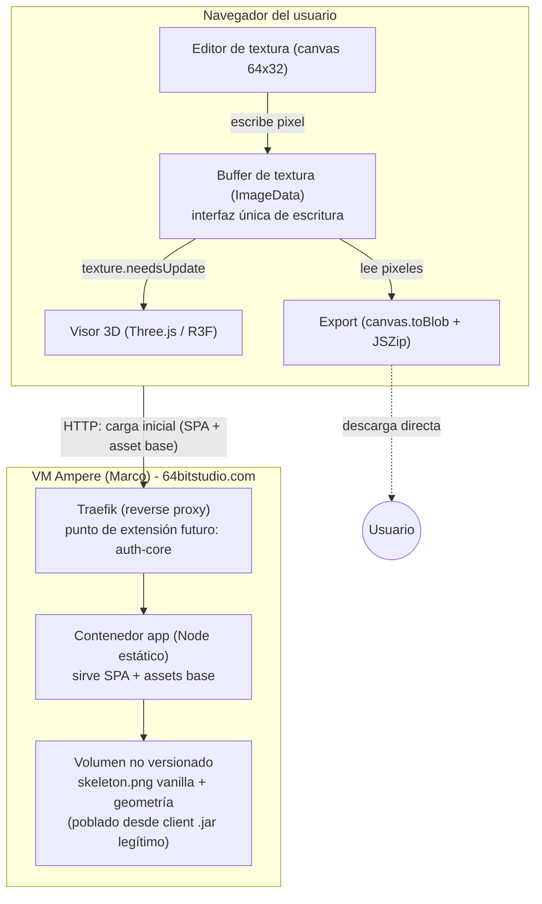
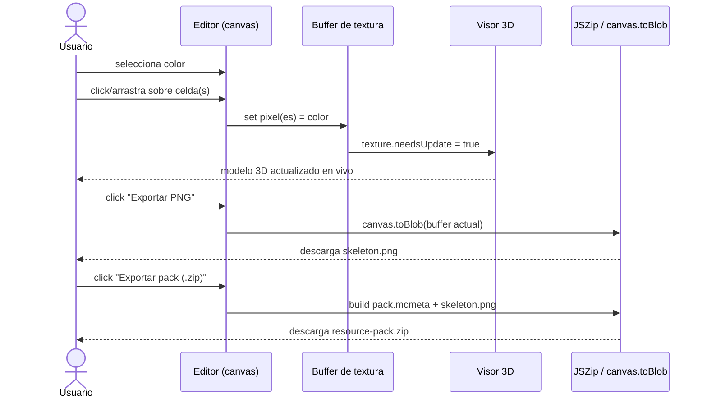

# Definición: Editor visual 3D de texturas de Minecraft (MVP: mob Esqueleto)

**Proyecto propuesto:** `texture-studio-mc` (nombre tentativo, a confirmar/ajustar en el VoBo).

## Resumen ejecutivo

Herramienta web que renderiza en 3D el modelo vanilla de un mob de Minecraft (arrancando por el Esqueleto) y permite pintar su textura pixel por pixel con feedback visual inmediato sobre el modelo, para luego exportar el PNG resultante o el ZIP completo de un resource pack (Java Edition, `pack_format` 75 / 1.21.11). Se despliega públicamente (sin autenticación en el MVP) en la VM Ampere Free de Marco, con arquitectura preparada para enchufar más adelante generación asistida por IA y el `auth-core` propio.

## Objetivo de negocio

Bajar la fricción de crear/editar resource packs para los servidores de Marco/Diana (ej. Galgoth): hoy la edición de texturas de mobs pasa por scripts Python (`minecraft-texture-pack-pipeline`, ver [[minecraft-texture-pack-pipeline]]) que no dan control visual pixel a pixel ni feedback 3D en vivo. Este editor cubre ese hueco con una herramienta directa, visual e intuitiva, y sienta las bases de producto para más mobs/bloques/ítems y, eventualmente, un ofrecimiento más amplio (alineado con la estrategia de "cores" — ver [[saas-paas-cores-strategy]] — aunque este proyecto en sí no es un "core" reusable por otros servicios, sino un producto/herramienta).

**Usuarios/roles:** Marco (autor principal) y, en el MVP, cualquier visitante con el link (acceso público sin login).

## Alcance

### Incluye (MVP)
- Visor 3D interactivo del modelo vanilla del Esqueleto (Three.js): geometría por cajas (cabeza, cuerpo, brazos, piernas) con el UV mapping clásico 64×32, y controles de cámara (orbit/zoom/pan).
- Carga de la textura base vanilla del Esqueleto como punto de partida.
- Editor de textura pixel por pixel: selector de color libre + paleta predefinida "estilo Minecraft", click en la cuadrícula (UV) pinta el pixel seleccionado.
- Sincronización en tiempo real: cada pixel pintado se refleja de inmediato en el modelo 3D (misma textura, sin recarga).
- Undo/redo del historial de edición.
- Simetría de pintura (eje configurable) — útil para un mob bilateral como el Esqueleto.
- Zoom y tamaño de cuadrícula ajustables en el editor de textura, para precisión pixel a pixel.
- Importar una textura PNG existente como punto de partida (reemplaza la textura base cargada).
- Pegar una imagen (recorte/captura) y reposicionarla/redimensionarla para encajar en una región UV específica del modelo (ej. la cara, el torso), en vez de solo pintar pixel a pixel.
- Exportar el PNG resultante de la textura.
- Exportar el ZIP completo del resource pack: `pack.mcmeta` (con `min_format`/`max_format` = `pack_format` 75, target 1.21.11 — mismo estándar que `minecraft-texture-pack-pipeline`) + `assets/minecraft/textures/entity/skeleton/skeleton.png`.
- Despliegue público (sin autenticación) en la VM Ampere de Marco, siguiendo la misma anatomía estándar de proyecto ya usada por `auth-core-mc`/`mail-core-mc` (Jenkinsfile + Shared Library, `docker-compose.{dev,qa,prod}.yml`, Traefik, subdominio propio en `64bitstudio.com`) — ver [[vm-deploy-infra-roadmap]].
- Arquitectura preparada (sin implementarlo aún) para dos extensiones futuras, de modo que sean aditivas y no un rediseño:
  1. Un backend de generación asistida por IA (Gemini/ChatGPT/etc.) que rellene o sugiera la textura.
  2. Integración con `auth-core` para restringir/gestionar acceso.

### No incluye (fases futuras — fuera de este MVP)
- Generación de texturas por IA (se define y prioriza más adelante; aquí solo se deja la costura de arquitectura).
- Autenticación/multiusuario real, y todo lo que dependa de identidad (proyectos por usuario, permisos).
- Persistencia de proyectos en servidor (guardar/retomar entre sesiones o dispositivos) — el MVP vive en la sesión del navegador.
- Otros mobs, bloques o ítems más allá del Esqueleto (arquitectura del editor debe ser extensible a futuro, pero solo se construye/valida con el Esqueleto).
- Edición de geometría/modelos 3D custom — solo "vanilla override" de textura sobre el modelo vanilla fijo.
- Previsualización de animaciones del mob (caminar, atacar, disparar arco) — solo pose estática de referencia.
- Shading/ambient occlusion automático generado por el sistema.
- Rate limiting/anti-abuso del endpoint público (ver riesgos).

## Historias de Usuario

### HU-1: Cargar y visualizar el modelo 3D vanilla del Esqueleto
Como usuario, quiero que al abrir la herramienta se cargue automáticamente el modelo 3D vanilla del Esqueleto con su textura base, para empezar a editar sin pasos previos.

Criterios de aceptación:
- Dado que abro la herramienta por primera vez, cuando la página carga, entonces veo el modelo 3D del Esqueleto renderizado con la textura vanilla, en una pose estática de referencia (T-pose o pose de reposo).
- Dado el visor 3D, cuando arrastro/hago scroll sobre él, entonces puedo rotar, hacer zoom y desplazar la cámara alrededor del modelo.

### HU-2: Pintar la textura pixel por pixel
Como usuario, quiero seleccionar un color y hacer click sobre la cuadrícula de la textura para pintar ese pixel, para editar la apariencia del mob con precisión.

Criterios de aceptación:
- Dado un color seleccionado (picker libre o paleta predefinida), cuando hago click en una celda de la cuadrícula de textura, entonces esa celda cambia al color seleccionado.
- Dado que mantengo presionado el click y arrastro sobre varias celdas, entonces todas las celdas recorridas se pintan del color seleccionado (modo "brocha").

### HU-3: Ver el resultado reflejado en tiempo real en el modelo 3D
Como usuario, quiero que cada pixel que pinto se vea inmediatamente sobre el modelo 3D, para verificar el resultado visual sin pasos de exportación/recarga.

Criterios de aceptación:
- Dado que pinto un pixel en la cuadrícula, cuando el cambio se aplica, entonces el modelo 3D refleja ese cambio en menos de un frame perceptible (sin recarga de página ni de textura completa).

### HU-4: Deshacer/rehacer cambios
Como usuario, quiero deshacer y rehacer mis últimas acciones de pintura, para corregir errores sin perder todo mi progreso.

Criterios de aceptación:
- Dado que pinté uno o más pixeles, cuando presiono "Deshacer", entonces el/los último(s) cambio(s) se revierte(n) en orden inverso.
- Dado que deshice un cambio, cuando presiono "Rehacer", entonces ese cambio se vuelve a aplicar.

### HU-5: Paleta de colores predefinida y selector libre
Como usuario, quiero elegir colores desde una paleta predefinida "estilo Minecraft" o desde un selector de color libre, para pintar rápido con colores consistentes o con total libertad.

Criterios de aceptación:
- Dado el panel de color, cuando lo abro, entonces veo una paleta de swatches predefinidos y también un selector de color libre (hex/RGB).
- Dado que elijo un swatch o un color libre, cuando pinto, entonces se usa exactamente ese color (incluyendo alpha si aplica).

### HU-6: Simetría de pintura
Como usuario, quiero activar simetría al pintar, para editar partes bilaterales del mob (ej. ambos lados de la cabeza) a la vez.

Criterios de aceptación:
- Dado que activo el modo simetría con un eje configurado, cuando pinto un pixel en una región con contraparte simétrica, entonces la contraparte se pinta también con el mismo color.
- Dado que el modo simetría está desactivado, cuando pinto, entonces solo se pinta el pixel exacto donde hice click (comportamiento por defecto).

### HU-7: Zoom y cuadrícula ajustable en el editor de textura
Como usuario, quiero acercar/alejar el editor de textura y ajustar el tamaño de la cuadrícula, para pintar con precisión pixel a pixel incluso en detalles pequeños.

Criterios de aceptación:
- Dado el editor de textura, cuando aumento el zoom, entonces cada pixel de la textura ocupa más espacio en pantalla sin perder nitidez (sin interpolación/blur).
- Dado un nivel de zoom, cuando pinto, entonces el pixel afectado corresponde exactamente a la celda bajo el cursor.

### HU-8: Importar una textura existente como punto de partida
Como usuario, quiero subir un PNG de textura ya existente (vanilla u otro pack) para editarlo, en vez de partir siempre de la textura base vanilla.

Criterios de aceptación:
- Dado que subo un PNG con las dimensiones correctas (64×32), cuando se carga, entonces reemplaza la textura actual tanto en la cuadrícula de edición como en el modelo 3D.
- Dado que subo un PNG con dimensiones incorrectas, cuando se intenta cargar, entonces la herramienta rechaza el archivo y muestra un mensaje claro del porqué.

### HU-9: Pegar/insertar una imagen y ajustarla a una región del modelo
Como usuario, quiero pegar o insertar una imagen (recorte) y poder reposicionarla/redimensionarla para que encaje en una región UV específica del modelo (ej. la cara), para incorporar detalle o arte externo sin pintarlo pixel a pixel.

Criterios de aceptación:
- Dado que pego/inserto una imagen, cuando la coloco sobre el editor de textura, entonces puedo arrastrarla y redimensionarla libremente antes de "confirmarla".
- Dado que confirmo la posición/tamaño, cuando se aplica, entonces la imagen se "quema" (rasteriza) en los pixeles de la región elegida de la textura, respetando los límites de esa caja UV.

### HU-10: Exportar el PNG de la textura
Como usuario, quiero exportar la textura resultante como PNG, para usarla directamente o inspeccionarla fuera de la herramienta.

Criterios de aceptación:
- Dado que edité la textura, cuando presiono "Exportar PNG", entonces se descarga un archivo `skeleton.png` con exactamente los pixeles actuales del editor (64×32, con canal alpha preservado).

### HU-11: Exportar el ZIP del resource pack completo
Como usuario, quiero exportar un ZIP listo para usar como resource pack de Minecraft, para no tener que armar manualmente la estructura de carpetas y `pack.mcmeta`.

Criterios de aceptación:
- Dado que edité la textura, cuando presiono "Exportar pack (.zip)", entonces se descarga un ZIP con `pack.mcmeta` (`pack_format`, `min_format` y `max_format` = 75) y `assets/minecraft/textures/entity/skeleton/skeleton.png` con la textura editada.
- Dado el ZIP exportado, cuando se coloca en la carpeta `resourcepacks` de un cliente Minecraft 1.21.11 y se activa, entonces el juego lo reconoce como compatible (no aparece como "Incompatible").

### HU-12: Arquitectura extensible hacia generación asistida por IA (fuera de alcance funcional del MVP)
Como equipo de desarrollo, quiero que el estado de la textura esté desacoplado de su origen (pintado a mano, imagen importada, o futura generación por IA), para poder integrar un proveedor de IA más adelante sin rediseñar el editor.

Criterios de aceptación:
- Dado el diseño del "buffer de textura" (los pixeles editables), cuando se documenta, entonces cualquier fuente de escritura (pincel, importar imagen, pegar imagen, futura IA) usa la misma interfaz de escritura sobre ese buffer.
- No se implementa ninguna llamada real a un proveedor de IA en este MVP.

### HU-13: Despliegue público en la VM Ampere, sin autenticación (MVP)
Como usuario, quiero acceder a la herramienta desde un link público, para usarla sin necesidad de crear cuenta.

Criterios de aceptación:
- Dado el subdominio de producción publicado, cuando lo visito desde fuera de la VM, entonces la herramienta carga y funciona de punta a punta (cargar modelo → pintar → exportar) sin pedir login.
- Dado el diseño del despliegue, cuando se revisa, entonces existe un punto de extensión claro (ej. middleware de reverse proxy o gate de aplicación) donde enchufar `auth-core` más adelante sin reescribir la app.

## Diseño técnico

**Frontend (SPA):** React + Vite + TypeScript. Visor 3D con `three.js` vía `@react-three/fiber` + `drei` (controles de órbita, carga de texturas). Editor de textura con `<canvas>` 2D nativo (no una librería de dibujo pesada) manipulando un `ImageData`/`ImageBitmap` de 64×32 que es a la vez: (a) lo que se pinta, y (b) la fuente de la `THREE.Texture` (`texture.needsUpdate = true` en cada cambio) — así HU-3 (sync en vivo) es gratis por construcción, no un paso aparte.

**Geometría del modelo:** cajas (cuboides) con las dimensiones/offsets UV vanilla del Esqueleto, formato clásico 64×32 (cabeza `(0,0)-(32,16)`, cuerpo `(16,16)-(40,32)`, brazo `(40,16)-(56,32)`, pierna `(0,16)-(16,32)`) — mismas coordenadas ya calibradas y en uso en `minecraft-texture-pack-pipeline` (ver [[minecraft-texture-pack-pipeline]]). Estas coordenadas de geometría (cajas/UV) son información técnica pública del formato de modelo, no un asset con copyright de Mojang, y se versionan en el repo sin problema.

**Origen de la textura vanilla base — decisión que reutiliza un patrón ya validado:** al igual que `minecraft-texture-pack-pipeline` (subcomando `corrupt`), la textura vanilla real (los pixeles de `skeleton.png`) **no se distribuye en el repo público** (son asset de Mojang). Se sirve desde un directorio de assets fuera de git, poblado una sola vez por Marco a partir de un client `.jar` legítimamente instalado (mismo mecanismo que ya usa `~/tools/minecraft-texture-pack/vanilla-cache/`), montado como volumen/config en el contenedor de despliegue. El backend solo expone ese archivo estático; no hay lógica de negocio compleja del lado servidor para esto.

**Backend:** deliberadamente mínimo — Node.js (Express o Fastify) sirviendo (1) el build estático del frontend y (2) el asset base (`skeleton.png` vanilla + definición de geometría) desde el volumen no versionado. La exportación (PNG y ZIP) ocurre **100% en el navegador** (canvas `toBlob` para el PNG, `JSZip` para el ZIP) — no hay round-trip al servidor para exportar, lo que también evita tener que persistir nada server-side para cumplir HU-10/HU-11.

**Estado/persistencia:** sin backend de persistencia en el MVP — el estado (textura en edición, historial de undo/redo) vive solo en memoria/`localStorage` del navegador durante la sesión, según lo confirmado por Marco.

**Despliegue:** sigue la anatomía estándar ya vigente para proyectos en la VM Ampere de Marco (ver [[vm-deploy-infra-roadmap]] y [[saas-paas-cores-strategy]]): `Jenkinsfile` usando la Shared Library compartida, `Dockerfile`, `docker-compose.{dev,qa,prod}.yml` conectado a la red `edge` con labels de Traefik, subdominio propio bajo `64bitstudio.com` (propuesta: `texture-studio.64bitstudio.com` prod, `-qa`/`-dev`), ramas `feature/NNN-slug → dev → qa → prod` con las mismas reglas de merge ya vigentes. Público, sin auth — se deja el gate de reverse proxy (Traefik middleware) como punto de extensión documentado para acoplar `auth-core` más adelante (HU-13).

## Diagramas

Muestra que la edición y exportación viven enteramente en el navegador (sin round-trip al servidor), que el backend solo sirve el asset vanilla desde un volumen fuera de git, y dónde queda el punto de extensión para `auth-core` (Traefik) sin tocar la app.

Muestra el ciclo pintar→reflejar en 3D y los dos flujos de exportación, ambos resueltos del lado del cliente.

## Riesgos y preguntas abiertas

1. **Nombre del proyecto/repo:** propuesto `texture-studio-mc` — pendiente de confirmación o cambio por parte de Marco.
2. **Subdominio de despliegue:** propuesto `texture-studio(-qa|-dev).64bitstudio.com` — pendiente de confirmación (evitar choque con subdominios ya usados por `auth`/`mail`/`sonarqube`/`traefik`/`portainer`).
3. **Fuente del asset vanilla en el pipeline de CI/CD:** el mecanismo de poblar el volumen no versionado con la textura vanilla real (extraída del client `.jar` de Marco) debe automatizarse o documentarse como paso manual único al desplegar — a definir en el ticket de despliegue, no bloquea el resto del MVP.
4. **Acceso público sin auth:** aceptado explícitamente por Marco para el MVP; sin límite de uso ni rate limiting definido. Como todo el trabajo pesado (edición, export) ocurre en el navegador, el costo de servidor por visitante es mínimo (solo servir estáticos) — riesgo bajo, pero queda nombrado por si el tráfico crece antes de tener `auth-core` integrado.
5. **Momento de integrar `auth-core` y la futura IA (Gemini/ChatGPT/etc.):** explícitamente fuera de este MVP — ambos quedan como fase futura a definir cuando Marco lo priorice.
6. **Pérdida de trabajo no exportado:** al no haber persistencia server-side, cerrar la pestaña sin exportar pierde el progreso — decisión explícita y aceptada por Marco para el MVP (no es un riesgo abierto, se documenta para que quede explícito).

## Impacto estimado

Lista tentativa de tickets (se refina al usar el skill `nuevo-ticket` tras el VoBo):

1. Bootstrap del proyecto (`bootstrap-proyecto`): repo, estructura `pending/in-process/done/docs`, Jenkinsfile+Shared Library, `docker-compose.{dev,qa,prod}.yml`, subdominio Traefik.
2. Visor 3D del Esqueleto vanilla (geometría por cajas + UV clásico 64×32, carga de textura base, controles de cámara).
3. Editor de textura pixel por pixel (canvas, selector de color + paleta, sync en vivo con el modelo 3D vía buffer compartido).
4. Undo/redo.
5. Simetría de pintura + zoom/grid ajustable.
6. Importar textura existente + pegar/ajustar imagen a una región UV.
7. Exportar PNG y exportar ZIP de resource pack (`pack.mcmeta` pack_format 75).
8. Automatizar/documentar el poblado del asset vanilla no versionado en el pipeline de despliegue.
