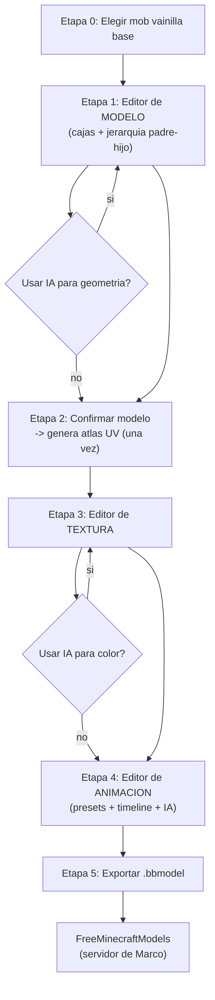
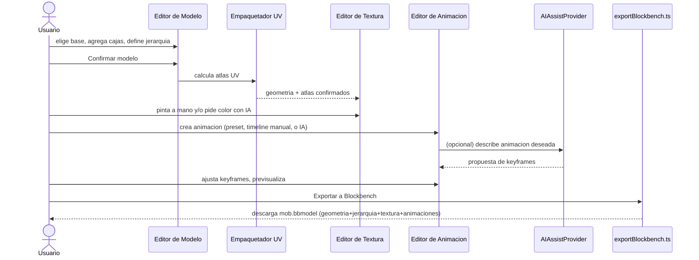
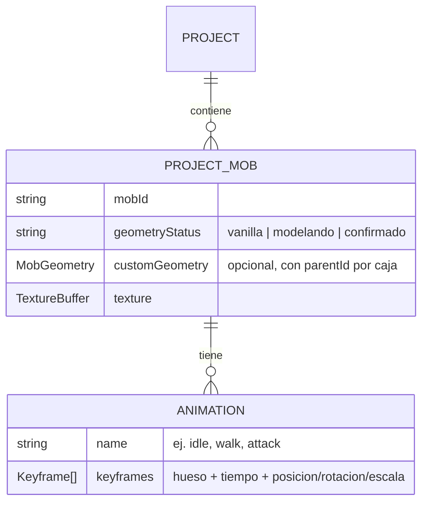

# Definición: Editor de modelos 3D custom con asistencia de IA

## Resumen ejecutivo

Hoy `texture-studio-mc` pinta texturas sobre 4 geometrías de mob fijas y ya verificadas (Esqueleto/Zombie/Araña/Creeper). Este cambio agrega, ANTES de pintar, una etapa de **modelado 3D**: partir de uno de esos mobs vainilla como base y agregar/mover/quitar/redimensionar cajas (cuboides), con relación padre-hijo entre ellas, para crear un modelo custom (ej. "un Zombie más realista, más musculoso") -- a mano, y/o con ayuda de IA que propone una geometría de partida a partir de una descripción de texto. Una vez confirmado el modelo, se genera automáticamente su atlas de textura y se reutiliza el editor de texturas ya existente para pintarlo -- también con ayuda opcional de IA. Como fase final antes de exportar, se agrega un **editor de animación** (presets paramétricos + timeline de keyframes completo + asistencia de IA), aprovechando la jerarquía de huesos definida en el modelado. El resultado se exporta como `.bbmodel` (formato de Blockbench, geometría + textura + animaciones), pensado para desplegarse con el plugin de servidor **FreeMinecraftModels**, que renderiza modelos custom animados a jugadores 100% vanilla sin necesidad de mods de cliente.

## Objetivo de negocio

Permitir a Marco crear mobs con apariencia, forma y **movimiento** completamente custom para su propio servidor de Minecraft, sin depender de aprender Blockbench ni de que los jugadores instalen mods -- todo el flujo de diseño (modelo + textura + animación, con asistencia de IA en los tres) vive dentro de la misma herramienta que ya usa hoy.

## Alcance

### Incluye
- **Etapa 0 -- Elegir base**: al agregar un mob a un proyecto, se parte de una de las 4 geometrías vainilla existentes como punto de anclaje.
- **Etapa 1 -- Editor de modelo 3D**: agregar/eliminar/mover/redimensionar/rotar cajas sobre la geometría base, con gizmos en el visor 3D existente. Solo cuboides/Box UV (sin mesh libre). **Cada caja puede declarar una caja "padre"**, formando una jerarquía de huesos (siguiendo la práctica recomendada por FreeMinecraftModels de un hueso raíz que contenga todo lo demás) -- necesaria para que animar un hueso arrastre visualmente a sus hijos.
  - Asistencia de IA (puente manual + API gratuita, ver "Diseño técnico") para proponer geometría a partir de una descripción de texto.
- **Etapa 2 -- Generar atlas UV (automático, una sola vez)**: al confirmar el modelo, se calcula el layout de textura para las cajas finales. La geometría de esa versión del mob queda bloqueada a partir de aquí.
- **Etapa 3 -- Editor de textura (reutilización total)**: herramientas ya existentes (pincel, borrador, simetría, aislar parte, deshacer/rehacer, resolución, importar imagen), ahora sobre geometría custom además de la vainilla. Regiones nuevas sin homólogo arrancan en color neutro/placeholder.
  - Asistencia de IA para una primera pasada de color por descripción.
- **Etapa 4 -- Editor de animación (nuevo)**: crear una o más animaciones nombradas sobre la jerarquía de huesos ya definida. FreeMinecraftModels reconoce **exactamente 5 nombres** para disparo automático por estado del mob (confirmado contra su documentación): `spawn` (una vez, al crear la entidad, luego pasa a `idle`), `idle` (loop mientras la velocidad ≤ 0.08), `walk` (loop mientras la velocidad > 0.08), `attack` (una vez, regresa a `idle`), `death` (una vez, al morir). Restricción documentada importante: **si `idle` no existe, el mob no puede salir de `walk` automáticamente** -- por eso `idle` es, en la práctica, obligatorio en cuanto se define cualquier otra.
  - **Presets paramétricos**: al crear una animación, partir de una plantilla para alguno de esos 5 nombres, con controles simples (velocidad, amplitud) que generan un set base de keyframes. Cualquier nombre fuera de esos 5 es una animación custom, solo disparable manualmente por código del lado del servidor (no por la app).
  - **Editor de keyframes completo**: timeline libre -- agregar/mover/eliminar keyframes de posición/rotación/escala en cualquier hueso y momento, con reproducción/pausa/scrub en el visor 3D. Un preset generado es simplemente el punto de partida de este mismo timeline, no un modo aparte.
  - **Asistencia de IA, en dos niveles de confianza**: (a) *ajuste de parámetros de preset* -- el usuario describe la animación (ej. "caminar arrastrando los pies") y la IA elige/tunea los parámetros del preset correspondiente (velocidad, amplitud, fase) en vez de inventar keyframes libres; problema acotado y fácil de validar, entra en v1 con alta confianza. (b) *keyframes libres* -- la IA propone una secuencia de keyframes completamente custom, fuera de los 5 presets; tratada como funcionalidad experimental/mejor-esfuerzo, puede quedar fuera de v1 sin bloquear nada más (ver "Riesgos").
- **Etapa 5 -- Exportar `.bbmodel`**: geometría + jerarquía de huesos + textura + animaciones nombradas, en formato "free" con Box UV, con las convenciones de nombres que requiera **FreeMinecraftModels**.
- **Modelo de datos**: cada mob dentro de un `ProjectRecord` gana un estado (`vanilla` / `modelando` / `confirmado`), su geometría custom (con jerarquía) cuando aplica, y sus animaciones -- persistido en el mismo `localStorage`, compatibilidad total con proyectos existentes.

### No incluye
- Geometría de malla libre (mesh) -- solo cuboides.
- Volver a editar la geometría de un mob después de confirmado (fin de Etapa 2) sin duplicar el proyecto.
- Integrar una API de IA de pago en esta primera versión -- queda como decisión técnica documentada y ticket futuro.
- Gestión de spawn/reemplazo de mobs vainilla en el servidor -- configuración del lado del plugin/servidor de Marco.
- Física de animación (ragdoll, IK) -- las animaciones son keyframes explícitos, sin simulación.

## Historias de Usuario

### HU-1: Elegir modelo base al agregar un mob
Como usuario, quiero elegir uno de los mobs vainilla existentes como punto de partida al agregar un mob a mi proyecto, para no empezar un modelo custom desde cero.

Criterios de aceptación:
- Dado que agrego un mob a un proyecto, cuando confirmo la selección, entonces entro al editor de modelo con la geometría vainilla de ese mob ya cargada como base editable.

### HU-2: Editar geometría manualmente en 3D
Como usuario, quiero agregar, mover, redimensionar, rotar y eliminar cajas sobre el modelo base, para darle una forma custom.

Criterios de aceptación:
- Dado el editor de modelo abierto, cuando agrego una caja nueva, entonces aparece en el visor 3D con gizmos para moverla/redimensionarla/rotarla, con un tamaño/posición por defecto razonable.
- Dado que elimino una caja que no es parte de la geometría vainilla original, cuando confirmo, entonces desaparece del modelo sin afectar las demás.

### HU-3: Definir jerarquía padre-hijo entre cajas
Como usuario, quiero indicar que una caja es "hija" de otra, para que al animar la caja padre, sus hijas se muevan junto con ella de forma natural.

Criterios de aceptación:
- Dado el editor de modelo abierto, cuando asigno una caja como hija de otra, entonces el visor 3D refleja esa relación (mover/rotar el padre visualmente arrastra a sus hijas en la previsualización).
- Dado un modelo recién creado a partir de un mob vainilla, cuando lo abro, entonces ya trae la jerarquía por defecto correspondiente sin que el usuario tenga que armarla: Esqueleto/Zombie con `body` como raíz y `head`/`armRight`/`armLeft`/`legRight`/`legLeft` como hijas; Araña con `thorax` como raíz y `head`/`abdomen`/las 8 patas como hijas; Creeper con `body` como raíz y `head`/las 4 patas como hijas.
- Dado que intento asignar una caja como hija de sí misma o de uno de sus propios descendientes, cuando lo intento, entonces la app lo rechaza con un mensaje claro (evita ciclos en la jerarquía).

### HU-4: Generar propuesta de geometría con IA (puente manual)
Como usuario, quiero describir en texto el cambio que busco y obtener un prompt listo para pegar en mi chat de IA de preferencia, para no pagar una API mientras pruebo la idea.

Criterios de aceptación:
- Dado que escribo una descripción y elijo "Generar con IA (copiar prompt)", cuando confirmo, entonces la app arma un prompt con la geometría base serializada + mi descripción, listo para copiar.
- Dado que pego la respuesta JSON en "Importar propuesta de geometría", cuando confirmo, entonces la app la valida contra el esquema esperado y, si es válida, la carga en el editor para revisión/edición.
- Dado un JSON inválido, cuando intento importarlo, entonces veo un error inline explicando qué falta, sin romper el modelo actual.

### HU-5: Generar propuesta de geometría con IA (API gratuita automatizada)
Como usuario, quiero un botón que genere la propuesta sin salir de la app.

Criterios de aceptación:
- Dado que elijo "Generar con IA (automático)", cuando confirmo, entonces la app llama a la API gratuita configurada (Gemini) y carga la propuesta igual que en HU-4.
- Dado que la llamada falla o excede cuota, cuando eso ocurre, entonces veo un error claro y la opción de usar el modo puente manual como respaldo.

### HU-6: Confirmar modelo y generar atlas UV
Como usuario, quiero confirmar que mi modelo está listo, para pasar a pintarlo con un atlas ya calculado.

Criterios de aceptación:
- Dado un modelo con al menos una caja, cuando presiono "Confirmar modelo", entonces la app calcula el layout UV sin traslapes y me lleva al editor de textura.
- Dado que ya confirmé el modelo, cuando intento volver al editor de modelo, entonces la opción no está disponible -- el mensaje explica que para cambiar geometría debo duplicar el proyecto.

### HU-7: Pintar textura sobre geometría custom
Como usuario, quiero usar las mismas herramientas de pintura que ya conozco sobre mi modelo custom.

Criterios de aceptación:
- Dado un modelo confirmado, cuando entro al editor de textura, entonces pincel/borrador/simetría/aislar-parte/deshacer-rehacer/resolución/importar-imagen funcionan igual que sobre un mob vainilla.
- Dado cajas nuevas sin homólogo en la textura original, cuando veo el atlas, entonces esas regiones aparecen en un color neutro/placeholder distinguible.

### HU-8: Generar propuesta de color con IA
Como usuario, quiero describir un estilo/color y obtener una primera pasada de pintura.

Criterios de aceptación:
- Dado el editor de textura abierto, cuando elijo "Generar color con IA" (cualquiera de los dos modos) y confirmo una propuesta válida, entonces el atlas se rellena, quedando disponible para seguir pintando encima.
- Dado que ya pinté manualmente antes, cuando aplico una propuesta de IA, entonces veo confirmación explícita de que se sobreescribirá lo ya pintado, antes de que ocurra.

### HU-9: Crear una animación desde un preset paramétrico
Como usuario, quiero partir de una plantilla para `spawn`/`idle`/`walk`/`attack`/`death` en vez de un timeline vacío, para no animar desde cero.

Criterios de aceptación:
- Dado el editor de animación abierto, cuando elijo un preset (uno de los 5 nombres reconocidos por FreeMinecraftModels) y ajusto sus parámetros (velocidad, amplitud), entonces se genera un set de keyframes sobre la jerarquía de huesos del modelo, visible y reproducible de inmediato en el visor 3D, guardado con ese nombre exacto.
- Dado un modelo cuya jerarquía no coincide con lo que un preset espera (ej. le faltan piernas), cuando intento aplicarlo, entonces veo un aviso claro de qué huesos faltan, sin romper el modelo.
- Dado que creo una animación `walk` pero no existe una `idle` en el mismo mob, cuando intento confirmar/exportar, entonces veo una advertencia explícita explicando que el mob no podrá volver a reposo en el juego sin una `idle` (restricción documentada del plugin), sin bloquear la exportación si el usuario decide continuar de todas formas.
- Dado que quiero un nombre fuera de esos 5, cuando la creo, entonces la app la guarda igual mencionando que solo será disparable manualmente por código del lado del servidor, nunca automática.

### HU-10: Editar keyframes manualmente
Como usuario, quiero agregar/mover/eliminar keyframes de posición/rotación/escala en cualquier hueso y momento, para afinar o crear animaciones libremente.

Criterios de aceptación:
- Dado el editor de animación abierto, cuando agrego un keyframe en un momento específico para un hueso, entonces aparece en el timeline y el visor 3D interpola entre keyframes al reproducir.
- Dado que reproduzco la animación, cuando un hueso padre tiene una rotación animada, entonces sus huesos hijos se mueven junto con él en el preview.

### HU-11: Generar una animación con IA (ajuste de parámetros de preset)
Como usuario, quiero describir la animación que busco (ej. "caminar arrastrando los pies") y que la IA elija los parámetros del preset correspondiente, para no tener que ajustar velocidad/amplitud a mano.

Criterios de aceptación:
- Dado que elijo un preset (`spawn`/`idle`/`walk`/`attack`/`death`) y describo el estilo deseado, cuando uso el modo puente manual o automático, entonces la IA devuelve valores de parámetros (no keyframes libres) dentro de los rangos válidos del preset, y se aplican de inmediato para previsualizar.
- Dado que los parámetros devueltos están fuera de rango, cuando se reciben, entonces la app los recorta a los límites válidos antes de aplicarlos, sin error visible al usuario.
- Dado que el resultado no me convence, cuando ajusto los sliders manualmente después, entonces el comportamiento es idéntico a haber elegido esos valores desde el inicio -- no hay un "modo IA" bloqueado.

### HU-12: Generar una animación con IA (keyframes libres, experimental)
Como usuario, quiero pedirle a la IA una animación completamente custom fuera de los 5 presets, aceptando que es la funcionalidad menos probada del proyecto.

Criterios de aceptación:
- Dado que describo una animación libre y uso el modo puente manual o automático, cuando recibo una propuesta válida, entonces se carga como keyframes editables en el timeline, sin reemplazar animaciones existentes de otro nombre.
- Dado que la propuesta importada tiene saltos de rotación bruscos entre keyframes consecutivos (por encima de un umbral) o, siendo una animación en loop, el último keyframe no es compatible con el primero, cuando se importa, entonces la app muestra una advertencia visual señalando los keyframes sospechosos, sin bloquear la importación.
- Dado que la propuesta no es satisfactoria, cuando la descarto, entonces el timeline vuelve a su estado previo sin rastros de la propuesta descartada.

### HU-13: Exportar a `.bbmodel` con animaciones
Como usuario, quiero exportar mi mob terminado (geometría + jerarquía + textura + animaciones) para usarlo con el plugin de mi servidor.

Criterios de aceptación:
- Dado un mob con modelo confirmado, textura pintada y al menos una animación, cuando exporto, entonces descargo un `.bbmodel` válido con todo lo anterior, incluyendo el array de animaciones nombradas.
- Dado ese archivo, cuando se carga en un entorno con FreeMinecraftModels (spike de validación), entonces el modelo se ve y las animaciones se reproducen correctamente en el juego.

## Diseño técnico

- **Generalización del tipo de geometría**: `MobGeometry.parts` ya es `Record<string, MobBoxPart>` -- se le suma un campo `parentId?: string` por caja para la jerarquía. Reconstruir el árbol es una función pura (`buildBoneTree`), sin cambiar el almacenamiento plano.
- **Jerarquía por defecto confirmada para los 4 mobs vainilla** (derivada de la geometría real ya existente, `backend/src/geometry/*.ts`): Esqueleto/Zombie (`buildClassicBipedGeometry`) con `body` como raíz y `head`/`armRight`/`armLeft`/`legRight`/`legLeft` como hijas; Araña con `thorax` como raíz y `head`/`abdomen`/las 8 `legNRight`/`legNLeft` como hijas; Creeper con `body` como raíz y `head`/`legFrontRight`/`legFrontLeft`/`legBackRight`/`legBackLeft` como hijas. Se implementa como una tabla estática por `MobId`, análoga a `MOB_REGISTRY`.
- **Modelo de datos de proyecto**: cada mob en `ProjectRecord` gana `geometryStatus`, su `MobGeometry` custom (con `parentId`) cuando aplica, y un nuevo campo `animations: Animation[]` (nombre + lista de keyframes por hueso/tiempo/canal).
- **Empaquetado de UV genérico**: algoritmo de packing (shelf packing) para calcular offsets de UV sin traslapes sobre un conjunto arbitrario de cajas.
- **Adaptador de asistencia de IA (`AIAssistProvider`)**: interfaz común generalizada a **tres tipos de propuesta** (geometría / color / animación), con las mismas dos implementaciones (`ManualBridgeProvider`, `FreeApiProvider`) -- migrar a una API de pago después es agregar un adaptador, no rediseñar.
- **Decisión de seguridad confirmada**: las llamadas a Gemini pasan por un endpoint mínimo del backend (`POST /api/ai/propose-geometry`, `POST /api/ai/propose-color`, `POST /api/ai/propose-animation`) que resguarda la API key -- se construye desde esta primera versión, no se pospone. Es la primera vez que el backend hace algo más que servir estáticos y el catálogo de mobs -- cambio de alcance del backend señalado explícitamente, confirmado con Marco.
- **Editor de animación**: reutiliza el mismo visor 3D (`Viewer3D.tsx`) para reproducir -- interpolación lineal entre keyframes como base (curvas de easing más avanzadas quedan fuera de esta versión salvo que se pida explícitamente). Los presets paramétricos son funciones puras que generan keyframes (mismo formato que produce el timeline manual o la IA), no un sistema aparte.
- **Export `.bbmodel`**: `exportBlockbench.ts` serializa geometría + jerarquía (`outliner` anidado) + texturas + el array `animations` en el formato que Blockbench/FreeMinecraftModels esperan. **Confirmado por el spike (ticket 080)**: nunca usar el atajo `box_uv`/`uv_offset` solo -- hay que calcular y escribir las 6 caras explícitas por caja (reusando el mismo cálculo que ya hace `applyBoxUV.ts`), y el objeto de cada textura necesita su set completo de campos (no solo `width`/`height`/`source`) o el parser de FreeMinecraftModels falla con un error que no identifica el campo faltante.
- **Validación de keyframes** (aplica a HU-12, IA de keyframes libres): antes de cargar una propuesta al timeline, se corre una función pura de sanity-check -- rango de rotación anatómicamente plausible por hueso, delta máximo entre keyframes consecutivos, y verificación de cierre de loop (primer y último keyframe compatibles) para animaciones pensadas como loop (`idle`/`walk`). No bloquea la importación, solo marca visualmente los keyframes sospechosos para revisión humana.
- **Secuenciación de validación de riesgo**: antes de construir el editor de modelo/textura/animación (tickets 2 en adelante), se ejecutan dos spikes baratos y desacoplados del resto del pipeline -- validar FreeMinecraftModels con un `.bbmodel` hecho a mano en Blockbench, y evaluar la calidad de Gemini/Claude proponiendo parámetros/keyframes de una animación simple con un puñado de prompts de prueba. Ver Impacto estimado, tickets 1 y 2.

## Diagramas

Muestra el flujo completo de 6 etapas, con la animación como fase final antes de exportar, apoyada en la jerarquía de huesos definida en la Etapa 1.

Muestra que el `AIAssistProvider` es el mismo componente en las tres etapas creativas (geometría, color, animación), y que el editor de animación es la última etapa antes de exportar.

Muestra los dos cambios de forma en el modelo de datos: geometría con jerarquía (`parentId`), y un mob que ahora puede tener una o más animaciones nombradas.

## Riesgos y preguntas abiertas

### Resueltos en esta ronda de revisión
- ~~Convenciones de nombres de animación~~ -- confirmado contra la documentación real de FreeMinecraftModels: exactamente `spawn`/`idle`/`walk`/`attack`/`death`, con la restricción de que `idle` es requerido para que el mob salga de `walk` (ver Alcance/HU-9).
- ~~Jerarquía por defecto de los 4 mobs vainilla~~ -- definida a partir de la geometría real ya existente (ver Diseño técnico y HU-3).
- ~~Seguridad de la API key de Gemini~~ -- decidido: se construye el endpoint backend desde esta primera versión (ver Diseño técnico e Impacto estimado, ticket 6).
- ~~El editor de keyframes es comparable en esfuerzo al editor de modelo~~ -- aceptado como hecho del tamaño real del trabajo; mitigado desglosándolo en 3 tickets independientes en vez de uno solo (Impacto estimado, tickets 9/10/11).

### Resueltos en esta segunda ronda (mecanismo concreto, no solo aceptación)
- **Spike de validación contra FreeMinecraftModels real**: en vez de ser el último ticket (riesgo descubierto solo al final, después de meses de construir todo el pipeline), pasa a ser el **primer** ticket del Impacto estimado, desacoplado del resto: un `.bbmodel` mínimo (2-3 cajas con jerarquía + textura simple + animaciones `idle`/`walk`) hecho a mano en Blockbench -- no con el editor propio, que todavía no existiría -- cargado en un servidor Paper/Spigot 1.21.4+ con Java 21 y el plugin instalado. Se verifica ahí, contra la realidad y no solo contra documentación: que la geometría/textura se vean bien, que `idle`/`walk` se disparen como está documentado, y que rotar un hueso padre arrastre visualmente a sus hijos. Cualquier discrepancia ajusta este documento ANTES de comprometer tickets sobre supuestos equivocados.
- **Calidad de la IA generando animación**: se acota el problema en vez de solo confiar en que salga bien -- HU-11 (alta confianza: la IA solo ajusta parámetros numéricos de un preset ya validado) se separa de HU-12 (experimental: keyframes 100% libres, con validación automática de rangos/continuidad/cierre de loop antes de mostrarse al usuario para revisión). Además, un segundo spike temprano y barato (Impacto estimado, ticket 2) prueba 5-10 prompts contra Gemini/Claude para un ciclo de caminar simple ANTES de construir la UI de "generar con IA" en animación -- si la calidad es consistentemente mala, se sabe temprano y se prioriza solo HU-11, dejando HU-12 fuera de v1 sin bloquear el resto.

### Resueltos por el spike 080 (ejecutado y cerrado, con verificación visual de Marco)
- ~~Spike de validación contra FreeMinecraftModels real~~ -- ejecutado de punta a punta contra Paper 1.21.11 + FreeMinecraftModels 2.11.2 + ResourcePackManager: geometría, textura, jerarquía padre-hijo y animaciones `idle`/`walk` confirmadas visualmente por Marco en el juego real. Ver `done/080-spike-validar-freeminecraftmodels-real.md`, "Hecho", para los 7 hallazgos concretos.
- Hallazgo crítico adicional (no anticipado en el documento original): **ResourcePackManager es un prerequisito no-opcional** junto a FreeMinecraftModels -- sin él, ningún modelo se ve (el cliente nunca recibe el resource pack generado). Se agrega como dependencia obligatoria de despliegue para cualquier ticket que llegue hasta probarse en el juego real (093).
- Hallazgo que **cambia una decisión técnica ya escrita en este documento**: el atajo `box_uv`/`uv_offset` NO es suficiente para FreeMinecraftModels -- se requieren las 6 caras UV explícitas por caja. Ya reflejado en "Diseño técnico" arriba.
- Hallazgo operativo: la fuente correcta de descarga de FreeMinecraftModels es **Modrinth**, no los releases "latest" de GitHub (que apuntan a una versión de 2024 previa a Minecraft 1.21, incompatible). Relevante para cualquier documentación de despliegue que se escriba más adelante.

### Riesgos aceptados explícitamente (no se eliminan del todo, se gestionan)
- **Migración futura a API de pago**: se deja deliberadamente sin fecha ni proveedor definitivo (Claude vs OpenAI) -- decisión para cuando el flujo gratuito esté validado. Confirmado que no bloquea el VoBo de este documento.

## Impacto estimado

Tickets tentativos (se refinan al usar `nuevo-ticket` después del VoBo), en el orden en que se recomienda ejecutarlos:
1. **Spike -- validar FreeMinecraftModels real** con un `.bbmodel` mínimo hecho a mano en Blockbench (geometría + jerarquía + textura + animaciones `idle`/`walk`), en un servidor Paper/Spigot de prueba. Se corre ANTES que todo lo demás.
2. **Spike -- calidad de IA para animación**: 5-10 prompts de prueba contra Gemini/Claude pidiendo parámetros de un ciclo de caminar simple, para decidir con datos si HU-12 (keyframes libres) entra en v1 o se pospone.
3. Modelo de datos: `geometryStatus` + geometría custom con `parentId` + `animations[]` por mob (compatibilidad con proyectos existentes).
4. Editor de modelo 3D manual (agregar/mover/quitar/redimensionar/rotar cajas), sin jerarquía ni IA todavía.
5. Jerarquía padre-hijo en el editor de modelo, con jerarquía por defecto para los 4 mobs vainilla.
6. Algoritmo de empaquetado UV genérico.
7. Confirmar modelo -> transición a Etapa 3, con bloqueo de regreso.
8. Endpoint backend proxy para llamadas a IA (`POST /api/ai/propose-*`) que resguarda la API key de Gemini -- prerequisito de los tickets 9/10/12.
9. `AIAssistProvider` base (puente manual + Gemini vía el endpoint del ticket 8) para geometría.
10. Extender `AIAssistProvider` a color -- Etapa 3.
11. Editor de animación: timeline básico (agregar/mover/eliminar keyframes, reproducir/pausar/scrub, respetando jerarquía) + presets paramétricos (`spawn`/`idle`/`walk`/`attack`/`death`), incluyendo la advertencia cuando falta `idle`.
12. Extender `AIAssistProvider` a animación -- HU-11 (parámetros de preset), con la validación automática de HU-12 (keyframes libres) si el spike 2 confirma que vale la pena construirla.
13. Export `.bbmodel` con geometría + jerarquía + textura (sin animaciones todavía).
14. Extender el export para incluir el array de animaciones.
