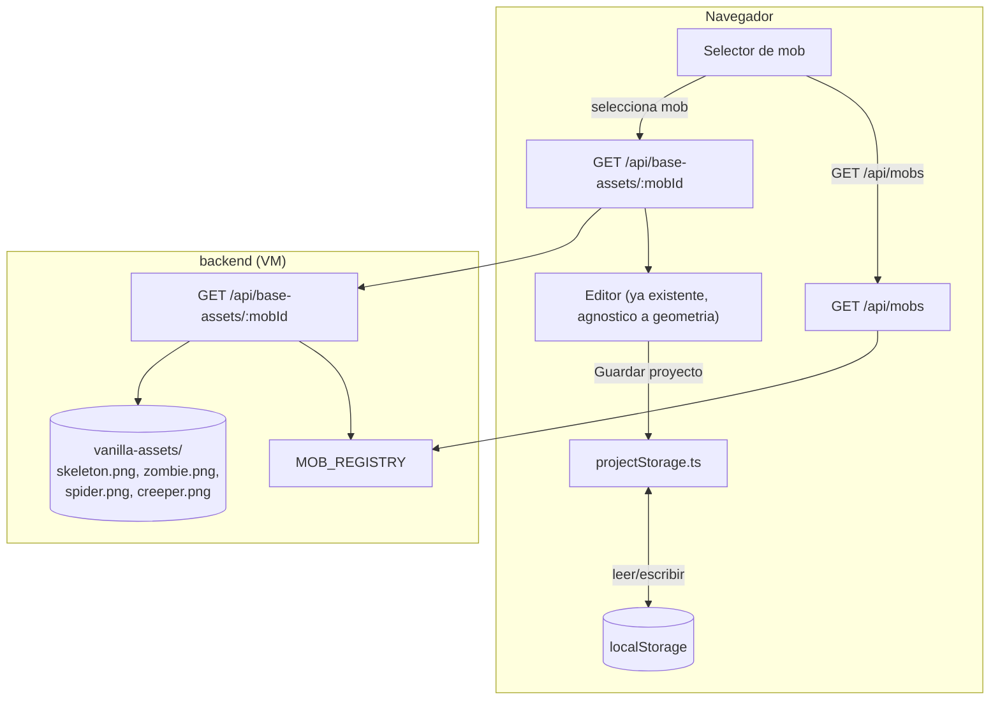
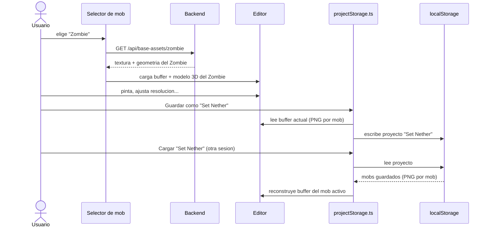

# Definición: Soporte multi-mob + proyectos guardados

## Resumen ejecutivo
Generaliza Texture Studio MC de "una herramienta del Esqueleto" a un editor con **selector de mob** (Esqueleto, Zombie, Araña, Creeper) — cada uno con su propio modelo 3D y mapa UV, investigado y verificado con el mismo rigor ya aplicado al Esqueleto — y agrega **guardado de proyectos con nombre en `localStorage`**, donde un proyecto puede contener el diseño de varios mobs a la vez.

## Objetivo de negocio
Hoy la app solo sirve para diseñar la textura del Esqueleto; todo el resto de la arquitectura (backend, geometría, assets) está hardcodeado a ese único mob. Generalizar a un registro de mobs multiplica el valor de la herramienta sin rehacer nada del editor ya construido (pintar, undo/redo, simetría, zoom, regiones nombradas, aislar partes, pegar imagen, exportar — todo eso ya es agnóstico a la geometría específica). El guardado de proyectos resuelve una limitación real del MVP (todo vivía solo en memoria de la pestaña — cerrar el navegador perdía el trabajo).

## Alcance

### Incluye
- Selector de mob (menú) con **Esqueleto, Zombie, Araña, Creeper**.
- Backend generalizado: catálogo de mobs (`GET /api/mobs`) + asset por mob (`GET /api/base-assets/:mobId`), reemplazando el endpoint hardcodeado actual.
- Geometría real e investigada para **Zombie** (estructura casi idéntica al Esqueleto — mismas 6 cajas, mismo layout UV 64×32/64×64, solo cambia el grosor de brazos/piernas — ya verificada contra `bedrock-samples` en esta misma sesión, ver "Diseño técnico").
- Geometría real e investigada para **Araña** y **Creeper** — anatomías nuevas para este proyecto (araña: cabeza+tórax+8 patas; creeper: cuerpo+4 patas cortas, sin brazos) — requieren la misma metodología del Esqueleto (contraste contra `bedrock-samples` + verificación empírica pixel a pixel contra el asset real) pero investigada desde cero.
- Asset vanilla real para Zombie y Araña — **ya cacheados** en `~/tools/minecraft-texture-pack/vanilla-cache/` (`zombie.png` 64×64, `spider.png` 64×32), listos para reusar sin volver a extraer nada.
- Asset vanilla real para Creeper — **no cacheado todavía**, hay que extraerlo (mismo mecanismo ya usado, client `.jar` legítimo).
- La mitigación de zonas UV muertas (ticket 015, `maskPixelsOutsideUVBoxes`) se generaliza sola — ya opera sobre las cajas del mob activo, no hay que tocarla.
- Guardado de proyectos en `localStorage`: un nombre de proyecto agrupa el diseño de **varios mobs a la vez** (ej. "Set Nether" con su Zombie + su Esqueleto). Cada mob dentro del proyecto guarda su buffer de pixeles completo, resolución de trabajo, y fecha de guardado.
- UI de proyectos: guardar (con nombre), listar proyectos guardados, cargar uno, eliminarlo.

### No incluye
- Más mobs además de los 4 listados (Enderman, Wither Skeleton, etc.) — quedan para una fase futura, cada uno con su propia investigación de geometría.
- Sincronizar proyectos entre dispositivos/navegadores — `localStorage` es por navegador, por diseño (misma limitación ya aceptada para otras conveniencias de sesión de este proyecto).
- Historial de undo/redo persistido — un proyecto guardado no conserva la pila de deshacer/rehacer, solo el resultado de pixeles (decisión ya confirmada por Marco).
- Exportar el pack de un mob que no sea el actualmente seleccionado directamente desde la lista de proyectos — para exportar un mob de un proyecto guardado, primero se carga el proyecto y se selecciona ese mob (flujo ya cubierto por lo existente).

## Historias de Usuario

### HU-1: Ver el catálogo de mobs disponibles
Como usuario, quiero ver un menú con los mobs soportados, para elegir cuál quiero diseñar.

Criterios de aceptación:
- Dado que abro la app, cuando reviso el menú de mobs, entonces veo Esqueleto, Zombie, Araña y Creeper listados con un nombre legible.

### HU-2: Seleccionar un mob y ver su propio modelo 3D y textura
Como usuario, quiero que al elegir un mob del menú, la app cargue SU modelo 3D y SU mapa de pixeles (no el del Esqueleto reusado a la fuerza).

Criterios de aceptación:
- Dado que selecciono "Zombie", cuando la app carga, entonces veo el modelo 3D del Zombie vanilla (brazos/piernas gruesos, formato 64×64) con su textura real, y el editor de textura muestra la cuadrícula con las dimensiones/UV correctas de ese mob.
- Dado que selecciono "Araña" o "Creeper", cuando la app carga, entonces veo el modelo 3D correspondiente (patas de araña / cuerpo+patas cortas de creeper) con su textura real.
- Dado cualquier mob seleccionado, cuando uso el editor (pintar, undo/redo, simetría, zoom, regiones nombradas, aislar partes, pegar imagen, exportar), entonces todo funciona igual que ya funciona hoy para el Esqueleto, sin comportamiento especial por mob.

### HU-3: Guardar el proyecto actual con un nombre
Como usuario, quiero guardarle un nombre a mi trabajo en curso, para poder recuperarlo después.

Criterios de aceptación:
- Dado que tengo diseños en curso (en uno o varios mobs visitados en esta sesión), cuando le pongo un nombre y guardo, entonces el proyecto queda almacenado en `localStorage` con el estado completo (pixeles + resolución de trabajo) de cada mob que haya tocado.
- Dado que el nombre ya existe, cuando intento guardar, entonces se me pide confirmar que quiero sobrescribirlo (nunca se sobrescribe en silencio).

### HU-4: Ver mis proyectos guardados y cargar uno
Como usuario, quiero ver la lista de proyectos que he guardado y abrir cualquiera de ellos.

Criterios de aceptación:
- Dado que tengo proyectos guardados, cuando abro la lista, entonces veo sus nombres y fecha de guardado.
- Dado que elijo cargar un proyecto, cuando termina de cargar, entonces cada mob que ese proyecto tenía guardado muestra exactamente el diseño con el que se guardó (mismos pixeles, misma resolución de trabajo).

### HU-5: Eliminar un proyecto guardado
Como usuario, quiero borrar un proyecto que ya no necesito.

Criterios de aceptación:
- Dado un proyecto guardado, cuando elijo eliminarlo, entonces se me pide confirmar (acción irreversible) y, tras confirmar, desaparece de la lista y de `localStorage`.

## Diseño técnico

**Backend — de un mob hardcodeado a un registro de mobs:**
- `backend/src/mobs/registry.ts` (nuevo): `MOB_REGISTRY: Record<MobId, MobDefinition>` — cada entrada define `id`, `label`, su geometría (mismo shape que `SkeletonGeometry` ya existe) y el nombre del archivo vanilla (`<mobId>.png`).
- `backend/src/geometry/`: un archivo de geometría por mob (`skeletonGeometry.ts` ya existe; se agregan `zombieGeometry.ts`, `spiderGeometry.ts`, `creeperGeometry.ts`), cada uno con sus cajas + `faceLabels` (ticket 011) propios.
- API nueva: `GET /api/mobs` (catálogo, para el menú) y `GET /api/base-assets/:mobId` (mismo contrato que hoy `/api/base-assets/skeleton`, parametrizado; 404 claro si `mobId` no existe). Se retira el endpoint hardcodeado actual.
- `loadSkeletonTexture` se generaliza a `loadMobTexture(mobId)` — misma lógica de fallback a placeholder si el archivo `vanilla-assets/<mobId>.png` no existe todavía (ej. Creeper, hasta que se extraiga).

**Geometría por mob — mismo método ya validado, investigado en esta sesión para Zombie:**
Confirmado contra [`Mojang/bedrock-samples/zombie.geo.json`](https://github.com/Mojang/bedrock-samples/blob/main/resource_pack/models/entity/zombie.geo.json) (fuente oficial): el Zombie usa **exactamente las mismas 6 cajas y los mismos orígenes UV que el Esqueleto** (head/body en las mismas posiciones, brazos en UV `(40,16)`, piernas en UV `(0,16)`, hat overlay en UV `(32,0)`) — la única diferencia real es el grosor de brazos/piernas: `[4,12,4]` (como Steve) en vez de `[2,12,2]` (huesos delgados del Esqueleto). Esto significa que `zombieGeometry.ts` es una copia casi directa de `skeletonGeometry.ts` con ese único cambio — bajo riesgo, ya validado antes de escribir una sola línea de código de implementación.

Araña y Creeper NO comparten esta estructura (anatomías distintas — 8 patas / sin brazos) y necesitan su propia investigación completa (bedrock-samples + verificación empírica pixel a pixel contra `spider.png`/`creeper.png` reales) como parte de sus propios tickets — no se asume su geometría en este documento.

**Frontend — ya mayormente agnóstico, cambios acotados:**
Todo el editor (`textureBuffer.ts`, `symmetry.ts`, `regionLabels.ts`, `partIsolation.ts`, `importImage.ts`, `export.ts`, `resolution.ts`, `uvBoxCleanup.ts`) ya recibe la geometría completa desde la respuesta del backend — no tiene nada hardcodeado al Esqueleto. El cambio real es agregar el selector de mob (fetch a `/api/mobs`, y re-fetch a `/api/base-assets/:mobId` al cambiar de selección) y el módulo de proyectos.

**Guardado de proyectos — PNG comprimido, no pixeles crudos:**
`localStorage` tiene una cuota típica de 5-10MB por origen, compartida entre todos los proyectos guardados. Guardar el buffer de pixeles crudo (`Uint8ClampedArray`) sería costoso: a resolución ×10, un solo mob pesa 640×320×4 ≈ 800KB sin comprimir. Decisión: cada mob dentro de un proyecto se guarda como **PNG codificado a base64** (reusando `encodeBufferToPngBlob`, ya existente desde el ticket 006) — el pixel-art comprime muy bien, así que el tamaño real por mob normalmente será de unos pocos KB, no cientos. Al cargar, se reusa `decodePngDataUrlToImageData` (ya existente) para reconstruir el buffer. Si `localStorage.setItem` lanza `QuotaExceededError` (poco probable en la práctica, pero posible con muchos proyectos a resoluciones altas), la app debe mostrar un mensaje claro pidiendo eliminar proyectos viejos — nunca fallar en silencio (regla del equipo).

**Formato de almacenamiento** (`frontend/src/projectStorage.ts`, nuevo módulo puro):
```jsonc
// localStorage["texture-studio-mc:projects"]
{
  "Set Nether": {
    "updatedAt": "2026-09-06T12:00:00Z",
    "mobs": {
      "zombie":   { "resolution": 4, "pngDataUrl": "data:image/png;base64,..." },
      "skeleton": { "resolution": 1, "pngDataUrl": "data:image/png;base64,..." }
    }
  }
}
```

## Diagramas


Muestra el registro de mobs como fuente única de verdad en el backend, y que el guardado de proyectos vive enteramente en el navegador (ningún dato de proyecto viaja al servidor).


Muestra que guardar/cargar es una operación 100% del navegador, reusando el mismo mecanismo de codificación PNG que ya existe para exportar (ticket 006).

## Riesgos y preguntas abiertas
- **Creeper sin asset vanilla cacheado todavía** — bloquea el soporte de Creeper hasta que se extraiga de un client `.jar` legítimo (mismo mecanismo ya usado). No bloquea Zombie ni Araña, que sí ya están cacheados.
- **Araña y Creeper requieren investigación de geometría desde cero** (anatomías nunca modeladas en este proyecto) — mayor esfuerzo/tiempo que Zombie, y mayor probabilidad de iteración (como pasó con la corrección de huesos del Esqueleto).
- **Exposición pública de más assets vanilla de Mojang sin auth**: ya aceptado para el Esqueleto (ticket 007) con VoBo explícito — este documento asume el mismo criterio aplica a Zombie/Araña/Creeper sin volver a preguntar por cada uno, salvo que Marco indique lo contrario en el VoBo de este documento.
- **`localStorage` es por navegador/perfil, no hay sincronización entre dispositivos** — limitación de diseño aceptada, no un bug a resolver aquí.

## Impacto estimado
1. Backend: registro de mobs + endpoints `/api/mobs` y `/api/base-assets/:mobId` (retira el endpoint hardcodeado del Esqueleto, sin romper su comportamiento).
2. Geometría + integración del Zombie (bajo riesgo, ya investigado en este documento).
3. Selector de mob en el frontend (menú + re-fetch al cambiar).
4. Guardado de proyectos: `projectStorage.ts` + UI de guardar/listar/cargar/eliminar.
5. Investigación + geometría de la Araña (anatomía nueva).
6. Investigación + geometría del Creeper (anatomía nueva) — depende de extraer primero su asset vanilla real.
7. Poblar `vanilla-assets/` en la VM con `zombie.png`/`spider.png`/`creeper.png` (mismo mecanismo del ticket 007).
