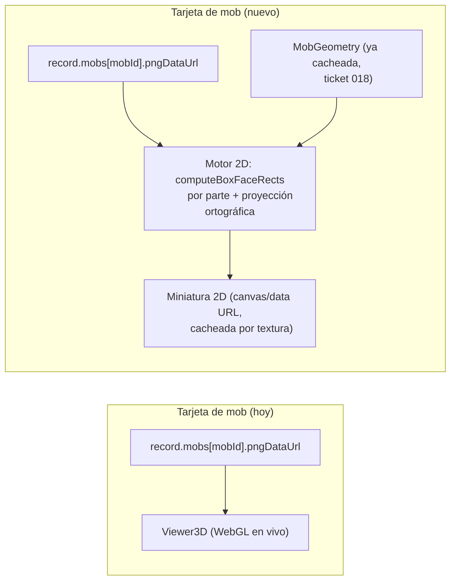

# Definición: Preview 2D de mobs + rediseño de la pantalla "Proyecto"

## Resumen ejecutivo

La pantalla "Proyecto" (detalle de un proyecto guardado, ticket 041) es la única pantalla importante que los tickets 046-054 no tocaron -- sigue con su layout original (título + botones sueltos con emoji + grid simple de tarjetas). Marco pidió puntualmente reemplazar el render 3D en vivo que hoy usa cada tarjeta de mob por una miniatura 2D de la textura real, y adjuntó una imagen de referencia (imagen #18) que en realidad muestra un rediseño completo de toda la pantalla. Tras una ronda de preguntas, se confirmó el alcance real: SÍ el rediseño completo de layout, pero NO la capacidad de tener varias skins nombradas del mismo mob en un proyecto (eso hubiera sido un cambio de arquitectura mucho más grande, descartado explícitamente).

## Objetivo de negocio

Que la pantalla de detalle de un proyecto (el lugar donde Marco pasa más tiempo eligiendo qué mob editar) se vea a la altura del resto de la app ya rediseñada (tickets 046-054), y que la miniatura de cada mob refleje su textura real (2D) en vez de gastar un render 3D en vivo por tarjeta -- más barato, más rápido, y evita que la vista se sienta inconsistente con "Mis proyectos" (que ya usa miniaturas simples).

## Alcance

### Incluye
- **Motor de preview 2D**: un compositor que arma una vista frontal 2D de un mob a partir de su textura real guardada, reusando el mapeo UV "cross" ya calculado (`computeBoxFaceRects`, `applyBoxUV.ts`) -- NO es la textura plana (el sprite sheet 64x32/64x64 tal cual), es una silueta 2D del personaje "de frente" compuesta cara por cara, como los visores de skins 2D clásicos de Minecraft. Reemplaza el `<Viewer3D>` que hoy usa cada tarjeta de mob dentro de "Proyecto".
- **Rediseño de layout de "Proyecto"**: breadcrumb ("Mis proyectos > Nombre"), imagen de portada del proyecto (subible, no decorativa fija), título editable inline (mismo patrón ya usado por "Renombrar"), descripción editable inline (campo NUEVO, no existía), badge fijo "Minecraft Java Edition" (mismo badge que ya usa "Nuevo proyecto", sin funcionalidad nueva), botones "Exportar proyecto" / "Agregar mob" reubicados en el header, y un panel lateral de "Acciones" (Renombrar / Duplicar / Exportar / Eliminar) que reusa exactamente la misma lógica ya construida en `ProjectCard.tsx` (tickets 053/054), mostrada como lista fija en vez de menú desplegable.
- **Rediseño de las tarjetas de mob**: buscador + orden + toggle grid/lista (mismo patrón ya construido en "Mis proyectos", ticket 053, reusado tal cual) sobre la lista de mobs del proyecto; cada tarjeta muestra nombre de archivo derivado (ej. "creeper.png"), dimensiones en px, escala de trabajo (`resolution`, ya existente) -- todos datos que YA existen o se derivan sin storage nuevo --, la miniatura 2D del motor de arriba, un botón "Editar textura" (va al editor, mismo destino que hoy) y un ícono de "ojo" que abre un preview ampliado de esa misma miniatura 2D (modal, sin ir al editor).
- Nuevo campo `coverImageDataUrl` (opcional) en `ProjectRecord` -- portada subida por el usuario, mismo mecanismo de `FileReader`/`dataURL` ya usado en el resto de la app, sin backend nuevo.

### No incluye
- **Múltiples skins nombradas del mismo tipo de mob en un proyecto** (ej. dos Esqueletos distintos con nombres propios) -- confirmado explícitamente con Marco que NO se quiere. `ProjectRecord.mobs` sigue siendo `Record<mobId, entry>`, sin cambio de forma. Las tarjetas de mob muestran el nombre del mob tal cual (Creeper/Araña/Esqueleto/Zombie), no un nombre custom por skin.
- Pestaña "Configuración del proyecto" -- se omite por completo (confirmado con Marco). Las acciones de gestión (renombrar/duplicar/exportar/eliminar) viven en el panel lateral de "Acciones" de la pantalla principal, no en una pestaña aparte.
- Selector "Minecraft Java Edition" funcional -- queda como badge fijo, sin dropdown ni soporte Bedrock (confirmado con Marco).
- Cambios a `Recientes.tsx`, `Mis proyectos` (ya rediseñada), `AgregarMobs.tsx`, o al flujo de "Nuevo proyecto" (su preview 3D en vivo se queda igual -- ahí SÍ tiene sentido un render 3D real, porque el usuario está eligiendo/creando, no navegando una lista).
- **El editor de texturas (`Editor.tsx`) NO se toca -- confirmado explícitamente con Marco.** El botón "Editar textura" de cada tarjeta sigue llevando exactamente al mismo editor que existe hoy, con su visor 3D en vivo (`Viewer3D.tsx`) intacto, historial, simetría, paleta de color, aislar parte, resolución, etc. -- sin ningún cambio. El preview 2D de este documento es SOLO para la miniatura dentro de la tarjeta y el modal del ícono de "ojo" (HU-1) -- dos superficies nuevas, no un reemplazo del editor real.
- El campo "Modelo: <nombre>" que aparece en la imagen de referencia se OMITE de la tarjeta de mob (ver "Riesgos y preguntas abiertas") -- sin soporte de múltiples skins por tipo, ese dato es 100% redundante con el nombre del mob que ya se muestra como título de la tarjeta.

## Historias de Usuario

### HU-1: Ver la miniatura 2D real de cada mob del proyecto
Como usuario, quiero ver una miniatura 2D de la textura real de cada mob en vez de un render 3D en vivo, para identificar rápido cuál es cuál sin el costo de renderizar WebGL por tarjeta.

Criterios de aceptación:
- Dado un proyecto con mobs guardados, cuando veo "Proyecto", entonces cada tarjeta muestra una silueta 2D "de frente" del mob compuesta con su textura real guardada (no el sprite sheet plano, no un ícono genérico).
- Dado que el mob tiene partes reflejadas (`mirrorX`, ej. brazos/piernas del layout 64x32), entonces la miniatura 2D respeta ese espejo igual que el visor 3D.
- Dado que abro el ícono de "ojo" de una tarjeta, entonces veo la misma miniatura 2D ampliada en un modal, sin navegar al editor.

### HU-2: Layout nuevo de la pantalla "Proyecto"
Como usuario, quiero que "Proyecto" se vea consistente con el resto de la app ya rediseñada, para no sentir un salto de calidad visual al entrar a un proyecto.

Criterios de aceptación:
- Dado que abro un proyecto, cuando veo su pantalla de detalle, entonces veo breadcrumb, portada, título, descripción, badge de edición, y los botones "Exportar proyecto"/"Agregar mob" en el header -- coincide con la imagen de referencia salvo lo explícitamente excluido (pestaña Configuración, selector de edición funcional, modelo por mob).
- Dado que hago click en el título o la descripción, entonces puedo editarlos inline (mismo patrón ya usado por "Renombrar", sin salir de la pantalla).
- Dado que subo una imagen de portada, entonces se guarda con el proyecto y se muestra la próxima vez que lo abro.
- Dado el panel lateral de "Acciones", cuando elijo Renombrar/Duplicar/Exportar/Eliminar, entonces pasa exactamente lo mismo que ya pasa desde "Mis proyectos" (misma lógica reusada, sin duplicar comportamiento).

### HU-3: Buscar y ordenar los mobs de un proyecto
Como usuario, quiero buscar/ordenar/cambiar entre grid y lista los mobs de un proyecto grande, para encontrar uno rápido sin scrollear todo.

Criterios de aceptación:
- Dado un proyecto con varios mobs, cuando escribo en el buscador, entonces la lista se filtra por nombre del mob.
- Dado que cambio el toggle grid/lista, entonces las tarjetas cambian de layout de verdad (mismo criterio del ticket 053 -- funcional, no decorativo).

## Diseño técnico

**Motor de preview 2D (decisión de mayor riesgo técnico de este cambio).** Se construye reusando `computeBoxFaceRects(u, v, w, h, d)` (`geometry/applyBoxUV.ts`, ya existe y ya está verificado pixel a pixel contra el pipeline de referencia) para obtener el rect de la cara `front` de cada `MobBoxPart` de la geometría. El compositor:
1. Recorre `geometry.parts`, toma el rect `front` de cada una (aplicando `mirrorX` si corresponde, mismo criterio que `applyBoxUV`).
2. Proyecta la posición 3D de cada parte a 2D de forma ortográfica: `x = position[0]`, `y = -position[1]` (Y de Minecraft crece hacia arriba, el canvas crece hacia abajo), ignorando profundidad para la posición -- pero usando `position[2]` para decidir el ORDEN de dibujado (de más lejos a más cerca de la cámara frontal), así una parte más cercana tapa correctamente a una más lejana.
3. Dibuja cada rect con `ctx.drawImage` desde un canvas fuente que ya tiene la textura completa cargada, con `imageSmoothingEnabled = false` (mismo criterio pixel-art que el resto de la app).
4. Devuelve una `data:` URL (u `OffscreenCanvas`/`ImageBitmap`) cacheada por `(pngDataUrl, geometry)` -- se recalcula solo si la textura del mob cambió, no en cada render de React.

**Riesgo aceptado explícitamente**: partes con `pivot`/`rotation` (hoy solo las patas de la Araña, ticket 024) se dibujan en su posición de "reposo" sin aplicar la rotación en 2D -- una rotación 2D correcta alrededor del pivote proyectado es posible pero se deja fuera de la primera iteración por complejidad/riesgo -- ver "Riesgos y preguntas abiertas". Si el resultado visual de la Araña no es aceptable, es un ajuste incremental sobre este mismo motor, no un cambio de arquitectura.

**`coverImageDataUrl` en `ProjectRecord`**: campo opcional nuevo, mismo patrón que `pngDataUrl` de cada mob (base64 vía `FileReader`) -- aditivo, no rompe proyectos guardados antes de este cambio (quedan sin portada hasta que el usuario suba una).

**`description` en `ProjectRecord`**: campo `string` opcional nuevo, mismo criterio aditivo.

**Reuso explícito, no reinvención**: el panel de "Acciones" y el buscador/orden/toggle de mobs NO son componentes nuevos desde cero -- extraen la lógica ya construida en `ProjectCard.tsx`/`MisProyectos.tsx` (ticket 053) a una forma reusable entre "lista de proyectos" (dropdown) y "detalle de un proyecto" (panel fijo), evitando duplicar `renameProject`/`duplicateProject`/`exportProjectZip`/`deleteProject` una tercera vez.

## Diagramas

Compara el camino actual (cada tarjeta monta un `<Viewer3D>` WebGL completo) contra el nuevo (una función pura que compone una imagen 2D una sola vez, reusando geometría y UV ya calculados en vez de tocar Three.js).

## Riesgos y preguntas abiertas

- **Fidelidad visual del motor 2D**: es una pieza técnica nueva sin precedente exacto en el proyecto (lo más cercano es el propio `Viewer3D`, que es 3D). Es razonable esperar 1-2 rondas de corrección visual después de la primera implementación, mismo patrón que ya pasó con el visor 3D (tickets 048-052) -- no se promete "perfecto a la primera".
- **Patas de la Araña sin rotación en la miniatura 2D**: aceptado como limitación conocida de la primera versión (ver "Diseño técnico"). Si Marco lo rechaza al verlo en vivo, es una mejora incremental del mismo motor.
- **Campo "Modelo: <nombre>" de la imagen de referencia**: se decidió OMITIRLO (ver "No incluye") por ser redundante sin soporte de múltiples skins. Si Marco lo quiere de todos modos por consistencia visual con la imagen (aunque repita el nombre del mob), es un ajuste menor de una ronda de corrección, no de este documento.

## Impacto estimado

055. Motor de preview 2D "de frente" de un mob (función pura + integración mínima de prueba) -- pieza base que los tickets 056/057 consumen.
056. Rediseño de layout de "Proyecto": breadcrumb, portada subible, título/descripción editable inline, badge fijo, botones de header, panel de "Acciones" (reusa lógica de `ProjectCard.tsx`). Incluye los campos nuevos `coverImageDataUrl`/`description` en `projectStorage.ts`.
057. Rediseño de tarjetas de mob dentro de "Proyecto": buscador/orden/toggle grid-lista + tarjeta con miniatura 2D (usa el motor del 055), info derivada (archivo/dimensiones/escala), botón "Editar textura" + ícono de ojo con preview ampliado.
