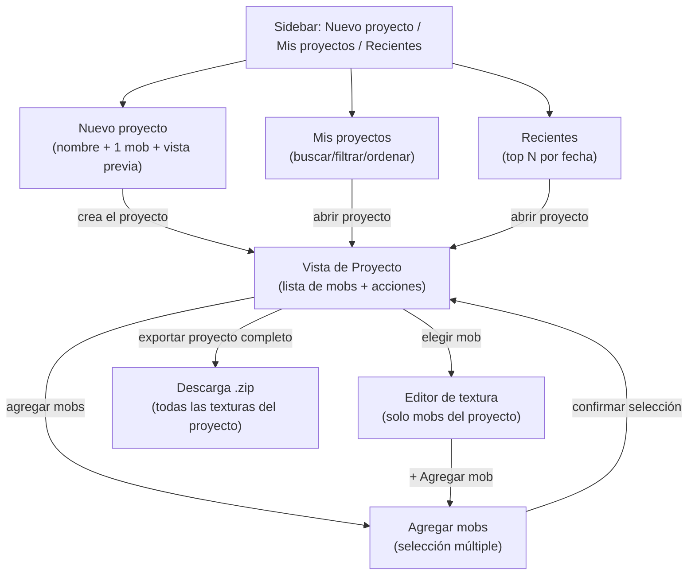
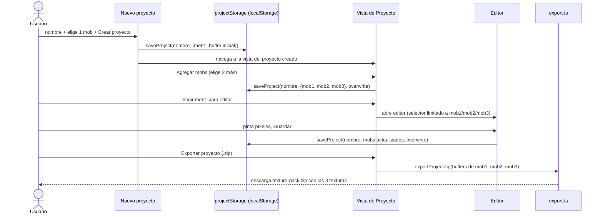

# Definición: Proyectos como concepto central + navegación nueva

## Resumen ejecutivo

Hoy la app permite editar la textura de cualquier mob libremente; "guardar como proyecto" es una acción aparte, casi accidental. Este cambio invierte esa relación: **el proyecto pasa a ser el punto de entrada obligatorio**. Se crea un proyecto con un nombre y un primer mob, se le agregan más mobs cuando se quiera, y solo dentro de un proyecto se edita una textura. Se reemplaza la pantalla de inicio actual (dos secciones apiladas) por una navegación de sidebar con tres destinos (Nuevo proyecto / Mis proyectos / Recientes) más una barra superior (tema claro/oscuro, configuración, perfil local), según el mockup de referencia entregado por Marco. También se agrega la exportación de TODAS las texturas de un proyecto en un solo `.zip`, reemplazando la exportación de un mob suelto.

## Objetivo de negocio

Dar a Marco (y a futuros usuarios del pack) un flujo de trabajo organizado por **proyecto** (ej. "Set Nether": Esqueleto + Zombie + Araña con una paleta coherente) en vez de mobs sueltos sin relación entre sí, y una navegación que se sienta como una herramienta real (sidebar persistente, tema, perfil) en vez de una pantalla única de inicio.

## Alcance

### Incluye
- Navegación nueva de dos zonas: sidebar (Nuevo proyecto / Mis proyectos / Recientes) + header (tema claro/oscuro, configuración, avatar local) -- reemplaza la pantalla de inicio actual (`HomeScreen.tsx`, tickets 027/028) y el binario `view: 'home' | 'editor'` de `App.tsx`.
- "Nuevo proyecto": nombre + selección de UN mob inicial + vista previa 3D en vivo, tal como el mockup -- crea el proyecto y navega a su vista de detalle.
- Vista de detalle de "Proyecto" (nueva): lista los mobs que ya pertenecen al proyecto, con acciones para elegir cuál editar, agregar más mobs, exportar el proyecto completo, renombrar y eliminar.
- "Agregar mobs" (nuevo): selección MÚLTIPLE (a diferencia de "Nuevo proyecto", que es de a uno) de los mobs que todavía no pertenecen al proyecto activo, para sumarlos de una vez.
- "Mis proyectos": la lista "Guardados" que ya existe (búsqueda por nombre + filtro por mob + orden, ticket 028) reubicada como su propio destino de navegación, sin cambios de lógica.
- "Recientes": los proyectos más recientemente guardados (mismo dato `updatedAt` que ya existe), sin controles de búsqueda/filtro -- una vista compacta, no una segunda copia de "Mis proyectos".
- Editor: el selector de mob de arriba deja de mostrar los 4 mobs siempre -- muestra solo los mobs que ya pertenecen al proyecto activo, más un control "+ Agregar mob" que abre el flujo de selección múltiple.
- Exportar TODAS las texturas de un proyecto en un solo `.zip` -- **reemplaza** la exportación actual de "solo el mob activo".
- Tema claro/oscuro real: toggle en el header, se persiste localmente, también editable desde "Configuración".
- Acento de color verde (mockup) reemplaza el acento morado/lila actual en todo el sistema de diseño.
- Perfil local (nombre + inicial del avatar) -- **sin cuentas de usuario, sin backend, sin login** -- se guarda en el navegador, editable desde "Configuración". No cambia la decisión de "sin autenticación" del ticket 001.
- Pantalla de "Configuración": editar nombre/avatar local, elegir tema, y un botón para borrar todos los datos locales (todos los proyectos guardados), con confirmación en línea.

### No incluye
- Cuentas de usuario reales, login, backend de autenticación, o cualquier dato de identidad que salga del navegador del usuario (confirmado explícitamente con Marco -- ver "Riesgos y preguntas abiertas" si esto cambia más adelante).
- Compartir proyectos entre usuarios/dispositivos, URLs de proyecto compartibles, o cualquier forma de sincronización -- los proyectos siguen viviendo solo en el `localStorage` del navegador activo (sin cambios respecto al ticket 019).
- Un límite de cuántos mobs distintos puede tener un proyecto más allá de los 4 ya soportados (Esqueleto/Zombie/Araña/Creeper) -- no se agregan mobs nuevos en este cambio.
- Migración de datos: los proyectos guardados ANTES de este cambio (con cualquier combinación de mobs, creados con el flujo viejo) se siguen abriendo y editando sin cambios -- la estructura de datos (`Record` por `mobId`) no cambia, solo el flujo alrededor de ella.

## Historias de Usuario

### HU-1: Crear un proyecto nuevo
Como usuario, quiero crear un proyecto dándole un nombre y eligiendo su primer mob, para empezar a trabajar en un set de texturas organizado.

Criterios de aceptación:
- Dado que estoy en "Nuevo proyecto", cuando escribo un nombre y elijo un mob, entonces veo una vista previa 3D en vivo de ese mob (misma limitación ya conocida: vista previa aproximada, no representa animaciones).
- Dado que hago click en "Crear proyecto" sin nombre o sin mob elegido, entonces veo un error inline y el proyecto no se crea.
- Dado que creo el proyecto con éxito, entonces navego a la vista de detalle de ESE proyecto, que ya muestra el mob elegido.
- Dado que el nombre ya existe entre mis proyectos guardados, cuando intento crear uno con el mismo nombre, entonces veo el mismo aviso de "ya existe / sobrescribir" que ya existe en el guardado actual (ticket 019) -- no se duplica esa lógica.

### HU-2: Ver y navegar el detalle de un proyecto
Como usuario, quiero ver qué mobs tiene un proyecto y elegir cuál editar, para retomar el trabajo donde lo dejé.

Criterios de aceptación:
- Dado un proyecto abierto, cuando veo su vista de detalle, entonces veo la lista de mobs que ya tiene (con alguna miniatura/indicador visual) y las acciones disponibles (agregar mobs, exportar todo, renombrar, eliminar).
- Dado que elijo uno de los mobs listados, cuando confirmo, entonces entro al editor de ESE mob, y el selector de mob de arriba muestra solo los mobs de este proyecto (más "+ Agregar mob").

### HU-3: Agregar mobs a un proyecto existente
Como usuario, quiero agregar uno o varios mobs nuevos a un proyecto que ya tiene otros, para completar el set sin crear un proyecto aparte.

Criterios de aceptación:
- Dado un proyecto abierto, cuando abro "Agregar mobs", entonces veo únicamente los mobs que TODAVÍA NO pertenecen a este proyecto (los que ya tiene no aparecen seleccionables, ya que un proyecto no puede tener dos texturas del mismo mob).
- Dado que selecciono uno o varios mobs y confirmo, entonces esos mobs quedan agregados al proyecto (con una textura placeholder/en blanco de partida, igual que hoy al abrir un mob nuevo) y disponibles en el selector del editor.

### HU-4: Exportar el proyecto completo
Como usuario, quiero exportar TODAS las texturas de un proyecto en un solo `.zip`, para obtener el resource pack completo de una vez.

Criterios de aceptación:
- Dado un proyecto con 1 o más mobs, cuando elijo "Exportar proyecto (.zip)", entonces descargo un único `.zip` con la textura de CADA mob del proyecto, empaquetada como resource pack válido (mismo mecanismo de `maskPixelsOutsideUVBoxes`/`encodeBufferToPngBlob` ya usado, aplicado a cada mob).
- Dado que esta exportación reemplaza la anterior, cuando busco exportar solo un mob suelto sin proyecto, entonces esa opción ya no existe (documentado como cambio de comportamiento intencional, no un olvido).

### HU-5: Navegación nueva (sidebar + header)
Como usuario, quiero una navegación persistente con Nuevo proyecto / Mis proyectos / Recientes, y accesos rápidos a tema/configuración/perfil, para moverme por la app sin volver a una pantalla de inicio genérica.

Criterios de aceptación:
- Dado cualquier punto de la app, cuando miro el sidebar, entonces veo los 3 destinos y cuál está activo.
- Dado que hago click en "Mis proyectos", entonces veo la misma lista con búsqueda/filtro/orden que ya existe (ticket 028), solo reubicada.
- Dado que hago click en "Recientes", entonces veo los proyectos más recientemente guardados, sin controles de búsqueda/filtro.
- Dado el header, cuando hago click en el toggle de tema, entonces la app cambia entre claro/oscuro al instante y esa preferencia persiste al recargar.

### HU-6: Perfil local y configuración
Como usuario, quiero poner mi nombre para verlo en el avatar, elegir el tema desde un solo lugar, y poder borrar todos mis datos locales, para personalizar la app y tener una salida de emergencia si quiero empezar de cero.

Criterios de aceptación:
- Dado que abro "Configuración", cuando cambio el nombre, entonces el avatar del header muestra la inicial de ese nombre de inmediato.
- Dado que cambio el tema desde "Configuración", entonces se refleja también en el toggle rápido del header (mismo dato, no hay dos preferencias separadas).
- Dado que elijo "Borrar todos los datos locales", entonces veo una confirmación en línea (nunca un diálogo nativo del navegador) antes de que se borre nada; al confirmar, se eliminan TODOS los proyectos guardados.

## Diseño técnico

- **Sin router, sigue aplicando (ticket 027)**: la navegación nueva (`nuevo-proyecto` / `mis-proyectos` / `recientes` / `proyecto` / `agregar-mobs` / `editor` / `configuracion`) sigue siendo un `view` interno en `App.tsx` (ahora un union type más grande, no un booleano), sin URLs -- no hay requisito nuevo de compartir/marcar enlaces, mismo criterio de simplicidad ya establecido.
- **El proyecto pasa a ser una entidad explícita desde su creación**: hoy `saveProject` es una acción única que agrupa lo que sea que esté en `bufferCache` al momento de apretar "Guardar". Con el flujo nuevo, el proyecto se `saveProject`-ea en el momento de "Crear proyecto" (con su primer mob) y se actualiza (mismo `saveProject` con `overwrite: true`, misma función) en cada acción posterior que lo modifique (agregar mobs, guardar una edición). No hace falta un nuevo formato de datos -- `ProjectRecord`/`ProjectSummary` (ticket 019/027) no cambian de forma, solo cuándo se llama a `saveProject`.
- **Editor restringido al proyecto activo**: `Editor`/`App.tsx` necesitan saber "cuál es el proyecto abierto ahora" -- nuevo estado `activeProject: {name: string, mobIds: string[]} | null` en `App.tsx`, poblado al entrar a la vista de Proyecto (desde crear/abrir) y limpiado al volver a Mis proyectos/Recientes. El selector de mob del editor (`MobSelector.tsx`) filtra contra `activeProject.mobIds` en vez de mostrar el catálogo completo, y gana la opción "+ Agregar mob" que navega a `agregar-mobs`.
- **Exportar proyecto completo**: nueva función en `export.ts` (ej. `exportProjectZip(mobs: Map<mobId, {buffer, uvBoxes}>)`) que itera los mobs del proyecto activo y arma un único `.zip` -- reusa `maskPixelsOutsideUVBoxes` por mob (mismo mecanismo del ticket 015, sin duplicar esa lógica) en vez de la función actual de un solo mob, que se retira.
- **Tema claro/oscuro**: los tokens de `index.css` (ticket 025) se separan en un bloque `:root[data-theme="dark"]` (default, valores actuales) y `:root[data-theme="light"]` (paleta nueva a definir en implementación, con el mismo contraste mínimo). Preferencia guardada en `localStorage` (`ts-theme`), aplicada como atributo en `<html>` al arrancar (sin parpadeo -- se lee antes del primer render). El control rápido del header y el de "Configuración" leen/escriben la MISMA preferencia -- una sola fuente de verdad, dos entradas de UI.
- **Acento verde**: se reemplaza el valor de `--accent` (hoy `#c084fc`) por un verde (propuesta de partida: `#4ade80`, a confirmar visualmente durante la implementación contra AMBOS temas, claro y oscuro, con captura de pantalla real antes de darlo por cerrado -- mismo criterio de verificación visual ya usado en tickets anteriores).
- **Perfil local**: nuevo módulo puro `frontend/src/userPrefs.ts` (`getUserPrefs`/`setUserPrefs`, `{displayName: string}`, con default `"Usuario"` si nunca se configuró) -- la inicial del avatar se DERIVA de `displayName` (primera letra), no es un campo separado, para no pedirle al usuario dos datos por una sola cosa visual.
- **Borrar todos los datos locales**: función nueva en `projectStorage.ts` (ej. `deleteAllProjects()`) que limpia únicamente las claves de `localStorage` que usa este proyecto (no todo el `localStorage` del origen, por si conviviera con otra cosa) -- confirmación en línea obligatoria antes de llamarla (mismo patrón ya usado para "Eliminar" un proyecto individual, ticket 019).
- **Compatibilidad con proyectos existentes**: como la forma de los datos no cambia, cualquier proyecto guardado con el flujo viejo (con cualquier combinación de mobs) se abre sin problema en la vista de detalle nueva -- no hace falta backfill ni migración.
- **Cambio de comportamiento señalado explícitamente (regla 9)**: se ELIMINA la edición libre de un mob sin proyecto (la actual "Selección de mob" directa de `HomeScreen`) -- a partir de este cambio, toda edición ocurre dentro de un proyecto. Confirmado explícitamente por Marco en la fase de definición (no es una decisión tomada sobre la marcha).

## Diagramas

Muestra los 7 destinos nuevos y cómo se llega de uno a otro -- en particular, que "Agregar mobs" es la ÚNICA puerta para sumar un mob nuevo a un proyecto (desde la vista de Proyecto o desde dentro del propio editor), y que exportar como `.zip` siempre parte de la vista de Proyecto (nunca de un mob suelto).

Muestra que `saveProject` (ya existente desde el ticket 019, sin cambio de forma) se llama en cada paso que modifica el proyecto -- crearlo, agregar mobs, guardar una edición -- en vez de una única acción de "guardar todo al final" como hoy.

## Riesgos y preguntas abiertas

- El hex exacto del acento verde y la paleta completa del tema claro (fondo, texto, bordes) no están definidos pixel a pixel en este documento -- se definen durante la implementación con verificación visual real (captura de pantalla en ambos temas), mismo criterio ya usado para el resto del sistema de diseño. Riesgo bajo: es un ajuste de valores de tokens, no de estructura.
- Eliminar la edición libre sin proyecto es un cambio de comportamiento real para cualquier flujo/hábito que Marco ya tuviera armado sobre la versión actual -- confirmado explícitamente arriba, pero se señala aquí una vez más por ser la desviación de mayor impacto de este cambio.
- No se definió un límite de cuántos proyectos se muestran en "Recientes" -- se propone 5 como punto de partida (ajustable sin impacto arquitectónico si Marco prefiere otro número al verlo en vivo).
- Si más adelante se necesitan cuentas de usuario reales (backend, login), eso es explícitamente un cambio aparte con su propia fase de definición y VoBo dedicado (regla 9) -- no se sienta ninguna base de autenticación en este cambio.

## Impacto estimado

Lista tentativa de tickets (se refina al desglosar con el skill `nuevo-ticket` tras el VoBo):

1. Sistema de tema claro/oscuro (tokens duales + toggle + persistencia en `localStorage`).
2. Acento verde (retoque de tokens de color existentes, verificado en ambos temas).
3. Preferencias locales de usuario (`userPrefs.ts`) + pantalla "Configuración" (nombre/avatar, tema, borrar datos locales con confirmación inline).
4. Shell de navegación nueva (sidebar + header) en `App.tsx`, reemplaza el binario `home`/`editor`.
5. Pantalla "Nuevo proyecto" (nombre + 1 mob + vista previa 3D).
6. Pantalla "Mis proyectos" (reubica la lista/búsqueda/filtro/orden ya existente).
7. Pantalla "Recientes" (top N por fecha, sin búsqueda/filtro).
8. Vista de detalle de "Proyecto" (lista de mobs, elegir/editar, renombrar, eliminar).
9. Flujo "Agregar mobs" (selección múltiple, excluye mobs ya presentes en el proyecto).
10. Selector de mob del editor restringido al proyecto activo + control "+ Agregar mob".
11. Exportar proyecto completo como `.zip` (reemplaza la exportación de un solo mob en `export.ts`).
12. Retiro del flujo de edición libre sin proyecto (limpieza de `HomeScreen`/rutas viejas, documentado como cambio de comportamiento).
