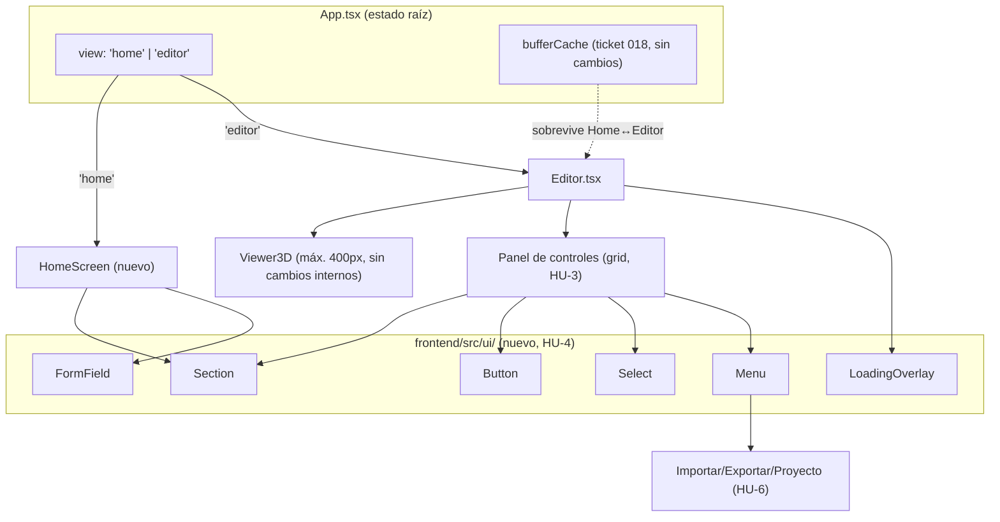

# Definición: Rediseño de UX/UI, navegación de inicio y sistema de componentes

## Resumen ejecutivo

Texture Studio MC pasa de una app de una sola pantalla (carga directo al editor del primer mob) a un flujo de dos entradas explícitas — elegir mob o retomar un proyecto guardado — con un editor rediseñado (visor 3D acotado a 400px, panel de controles reorganizado en secciones), una herramienta de borrado, importación/exportación agrupada en un menú, y un sistema mínimo de componentes reutilizables que se aplica a todo el panel existente (no solo a lo nuevo) para que agregar el próximo control no implique reconstruir su formulario desde cero.

## Objetivo de negocio

Marco (Product Owner y usuario principal de la herramienta) reportó que la UI actual — un panel lateral con ~15 controles apilados sin agrupación, visor 3D sin límite de tamaño, import/export mezclado inline con el resto — ya no escala bien: cuesta encontrar controles, el visor compite por espacio con el formulario, y cada control nuevo se construye desde cero sin reutilizar nada. El objetivo es una herramienta más rápida de usar para su flujo real (elegir o retomar un mob, pintar, exportar) y más barata de seguir extendiendo (nuevos mobs, nuevos controles) sin que cada uno reinvente su propio formulario.

## Alcance

### Incluye
- Pantalla de inicio con dos entradas: "Selección de mob" y "Guardados" — reemplaza la carga directa al editor.
- Pantalla de "Guardados": lista de proyectos con búsqueda por nombre, filtro por mob contenido, y orden por fecha/nombre.
- Reorganización del editor: visor 3D acotado a 400px máximo, panel de controles en grid de 2-3 columnas agrupado por sección.
- Sistema mínimo de componentes reutilizables (botón, campo de formulario, select, tarjeta/sección, menú desplegable, overlay de carga) aplicado a **todos** los controles existentes del panel (no solo los nuevos).
- Herramienta de borrado: pincel de tamaño ajustable, mismas reglas que pintar (respeta simetría y aislar-parte).
- Menú unificado de "Archivo": importar textura, pegar imagen, exportar PNG, exportar pack `.zip`, guardar/cargar/eliminar proyecto — todo agrupado ahí.
- Iconografía consistente y transiciones/microinteracciones en los controles principales.
- Estados de carga: pantalla de carga inicial (catálogo + asset base) y en transiciones internas (cambio de mob, carga de proyecto guardado).

### No incluye
- Cambios al modelo de datos de `localStorage` (formato de proyecto, ticket 019) — la búsqueda/filtro de "Guardados" es una vista nueva sobre datos que ya existen, sin tocar `projectStorage.ts`.
- Tamaño de pincel ajustable para la herramienta de **pintar** normal (solo aplica a la herramienta de borrado, tal como se pidió explícitamente) — queda como mejora futura si se pide.
- Autenticación / proyectos en la nube — sigue siendo 100% `localStorage` del navegador actual (decisión ya tomada en el ticket 001, sin cambios).
- Geometría/UV de ningún mob — este cambio es puramente de interfaz, no toca `backend/src/geometry/*` ni `applyBoxUV.ts`.
- Un router de URLs (`react-router` o similar) — la navegación Home/Editor es un estado interno de `App.tsx`, no rutas navegables por URL (ver "Diseño técnico").

## Historias de Usuario

### HU-1: Pantalla de inicio con dos entradas
Como usuario de Texture Studio MC, quiero ver una pantalla de inicio con "Selección de mob" y "Guardados" al abrir la app, para elegir explícitamente si empiezo un mob desde cero o retomo un proyecto existente.

Criterios de aceptación:
- Dado que abro la app, cuando carga, entonces veo la pantalla de inicio (no el editor directamente) con dos opciones claramente distinguibles.
- Dado que hago click en "Selección de mob", cuando elijo un mob del catálogo, entonces se abre el editor para ese mob (comportamiento de carga de asset base ya existente, sin cambios).
- Dado que estoy en el editor, cuando quiero volver a elegir, entonces existe un control visible (ej. en el header) que me regresa a la pantalla de inicio sin perder el buffer en memoria de los mobs ya visitados en esta sesión (ticket 018, sin cambios de comportamiento).

### HU-2: Abrir un proyecto guardado desde la pantalla de inicio
Como usuario, quiero ver mis proyectos guardados en la pantalla de inicio y abrir uno directamente, para continuar un trabajo anterior sin pasos intermedios.

Criterios de aceptación:
- Dado que hago click en "Guardados", cuando la lista carga, entonces veo todos los proyectos guardados (nombre, fecha, mobs que contiene).
- Dado que escribo en el campo de búsqueda, cuando el texto coincide con el nombre de un proyecto, entonces la lista se filtra en tiempo real.
- Dado que selecciono un filtro por mob (ej. "Araña"), cuando se aplica, entonces solo veo proyectos que incluyen ese mob.
- Dado que elijo un orden (fecha/nombre), cuando se aplica, entonces la lista se reordena.
- Dado que hago click en un proyecto de la lista, cuando se abre, entonces el editor carga con el/los mob(s) y buffers exactos de ese proyecto (mismo mecanismo ya verificado en el ticket 019, sin cambios de datos).

### HU-3: Editor con visor acotado y panel reorganizado
Como usuario, quiero que el visor 3D tenga un tamaño fijo razonable (máx. 400px) y el resto del ancho lo use el panel de controles, para tener más espacio real para trabajar con el formulario sin que el visor lo acapare.

Criterios de aceptación:
- Dado el editor abierto en una ventana de ancho normal (>1000px), cuando se renderiza, entonces el visor 3D nunca excede 400px de ancho y el panel de controles ocupa el resto.
- Dado el panel de controles, cuando se renderiza, entonces sus secciones (Color, Vista, Simetría, Resolución, Aislar parte, Archivo) se agrupan visualmente en tarjetas dispuestas en un grid de 2-3 columnas (según ancho disponible), no en una sola columna apilada como hoy.
- Dado que la ventana es angosta (responsive), cuando no cabe el grid de columnas, entonces el panel colapsa a una columna sin romper ningún control (mismo criterio de "pixeles siempre cuadrados" del ticket 010, sin regresión).

### HU-4: Sistema de componentes reutilizables
Como desarrollador de este proyecto (Claude Code en sesiones futuras), quiero que todos los controles del panel usen un set común de componentes base (botón, campo, select, tarjeta), para que agregar un control nuevo no implique escribir su formulario desde cero cada vez.

Criterios de aceptación:
- Dado un nuevo módulo `frontend/src/ui/` con los componentes base, cuando se revisan los ~15 controles existentes del panel (`ColorPicker`, `ResolutionControls`, `SymmetryControls`, etc.), entonces todos usan esos componentes base para su estructura visual (label + input + spacing), no markup ad-hoc propio.
- Dado que se agrega un componente nuevo a partir de este cambio (ej. el menú de Archivo, la herramienta de borrado), cuando se implementa, entonces reutiliza los mismos componentes base, no introduce un patrón nuevo.
- Dado el refactor de los controles existentes, cuando se verifica en vivo, entonces el comportamiento funcional de cada control (pintar, cambiar resolución, deshacer, etc.) es idéntico a antes del refactor — cambio de estructura visual, no de lógica.

### HU-5: Herramienta de borrado
Como usuario, quiero un botón de "Borrar" que active un modo de borrado de píxeles con tamaño de pincel ajustable, para limpiar zonas de la textura sin tener que pintar encima con otro color.

Criterios de aceptación:
- Dado que activo el modo "Borrar", cuando hago click/arrastro sobre la cuadrícula, entonces los píxeles bajo el pincel quedan transparentes (`alpha=0`), usando el mismo pipeline de pintado que ya existe (`applyPixelsWithSymmetry`).
- Dado que tengo simetría activa, cuando borro, entonces también se borra el píxel espejado (misma regla que pintar).
- Dado que tengo una parte aislada, cuando borro, entonces solo se borran píxeles dentro de esa parte (misma regla que pintar).
- Dado el control de tamaño de pincel del modo borrar, cuando lo aumento, entonces el área borrada por cada click/arrastro crece en consecuencia (bloque de N×N píxeles alrededor del punto).
- Dado que exporto el PNG/pack después de borrar, cuando se genera, entonces las zonas borradas quedan transparentes en el archivo exportado (consistente con el enmascarado de zonas fuera de las cajas UV ya existente, ticket 015).

### HU-6: Menú unificado de Archivo (importar/exportar/proyectos)
Como usuario, quiero que importar, exportar y guardar/cargar proyectos vivan en un solo menú, para no tener esos controles dispersos ocupando espacio permanente en el panel.

Criterios de aceptación:
- Dado el editor, cuando busco importar/exportar/guardar, entonces encuentro un único punto de entrada (ej. botón "Archivo" con menú desplegable) que agrupa: Importar textura, Pegar imagen, Exportar PNG, Exportar pack `.zip`, Guardar proyecto, Cargar proyecto, Eliminar proyecto.
- Dado que abro el menú, cuando eligo una opción, entonces se ejecuta el mismo comportamiento ya verificado de esa acción (sin cambios de lógica, solo de ubicación en la UI).

### HU-7: Iconografía y transiciones
Como usuario, quiero iconos consistentes en los controles principales y transiciones suaves al cambiar de estado (abrir menú, cambiar de mob, activar un modo), para que la app se sienta pulida y sea más fácil de escanear visualmente.

Criterios de aceptación:
- Dado cualquier botón de acción principal (Deshacer, Rehacer, Borrar, Archivo, Guardar, Volver al inicio), cuando se renderiza, entonces incluye un ícono reconocible junto a su texto (nunca solo ícono sin texto, por accesibilidad).
- Dado un cambio de estado visual (abrir/cerrar el menú de Archivo, cambiar de mob, activar aislar-parte), cuando ocurre, entonces se anima con una transición corta (~150-250ms), respetando `prefers-reduced-motion`.

### HU-8: Estados de carga
Como usuario, quiero ver un indicador de carga claro tanto al abrir la app como al cambiar de mob o cargar un proyecto, para saber que la app está trabajando y no que se congeló.

Criterios de aceptación:
- Dado que abro la app, cuando el catálogo de mobs y el asset base todavía no llegaron, entonces veo una pantalla de carga (no una pantalla en blanco ni el editor a medio renderizar).
- Dado que cambio de mob desde el selector, cuando el asset base de ese mob todavía no está en cache, entonces veo un indicador de carga en el área del editor mientras se resuelve.
- Dado que cargo un proyecto guardado, cuando los buffers se están decodificando, entonces veo un indicador de carga hasta que el editor esté listo para pintar.

## Diseño técnico

### Navegación Home ↔ Editor: estado interno, no router

`App.tsx` gana un estado `view: 'home' | 'editor'` (mismo criterio ya usado en el proyecto para estado derivado simple, sin librerías nuevas). No se introduce `react-router`: no hay necesidad real de URLs navegables/compartibles para este flujo (la app sigue siendo de una sola página, sin backend de sesión), y agregar un router sería complejidad no pedida por ninguna HU. "Volver al inicio" (HU-1) es un botón en el header del editor que solo cambia `view` a `'home'` — el `bufferCache` (ticket 018) vive en `App.tsx` por encima de `view`, así que sobrevive el viaje de ida y vuelta sin cambios.

### Pantalla de "Guardados": filtro/orden 100% client-side

`projectStorage.ts`/`projectSnapshot.ts` (ticket 019) no cambian — ya exponen `listProjects()` con nombre/fecha/mobs por proyecto. La búsqueda, el filtro por mob y el orden (HU-2) son puro cómputo en el componente nuevo `HomeScreen.tsx` (o similar) sobre el array que ya devuelve `listProjects()`, sin tocar el esquema de `localStorage` ni agregar índices — el volumen esperado de proyectos guardados (uso personal de Marco) no justifica más que un `.filter()`/`.sort()` en memoria.

### Sistema de componentes (`frontend/src/ui/`)

Módulo nuevo con primitivas mínimas, cada una un wrapper delgado sobre HTML nativo con estilos consistentes vía tokens CSS (no una librería externa — sigue la regla del proyecto de "sin dependencias nuevas si no hace falta"):
- `Button` (variantes: primario, secundario, ícono) — reemplaza los `<button>` sueltos de cada control.
- `FormField` (label + input/select/número, con el mismo patrón de accesibilidad ya usado — `<label>` envolviendo o `htmlFor`, nunca solo `placeholder`).
- `Select` — reemplaza los `<select>` nativos actuales, mismo elemento nativo por debajo (accesibilidad/teclado gratis), solo estilo consistente.
- `Section`/`Card` — agrupador visual con título, usado para las tarjetas del grid del panel (HU-3).
- `Menu`/`MenuButton` — el menú desplegable de Archivo (HU-6), disclosure pattern accesible (`aria-expanded`, cierre con Escape/click-fuera).
- `LoadingOverlay`/`Spinner` — estados de carga (HU-8).

Refactor de los ~15 controles existentes (HU-4): cambio de MARKUP/estilo únicamente, cero cambio de lógica de negocio (`Editor.tsx` sigue siendo dueño de todo el estado real) — mismo criterio de riesgo ya aplicado en refactors anteriores de este proyecto (ej. `classicBipedGeometry.ts` en el ticket 017): extraer sin alterar comportamiento, verificado en vivo control por control.

### Borrado: mismo pipeline de pintado, color especial

La herramienta de borrado (HU-5) no es un mecanismo paralelo: es un modo (`paintMode: 'paint' | 'erase'`) en `Editor.tsx` que, al pintar, escribe `{r:0,g:0,b:0,a:0}` en vez del color de la paleta activa, pasando por el mismo `applyPixelsWithSymmetry` que ya respeta simetría y aislar-parte. El "tamaño de pincel" (nuevo concepto, no existía) se implementa como un radio N que, en vez de escribir un solo punto por evento de pointer, escribe un bloque cuadrado de N×N píxeles centrado en el punto -- acotado a este modo, no se extiende al pincel de pintar normal (fuera de alcance, HU explícita).

### Layout del panel: CSS Grid con `auto-fit`

El grid de 2-3 columnas (HU-3) usa `grid-template-columns: repeat(auto-fit, minmax(280px, 1fr))` (o equivalente) para que el número real de columnas sea responsive sin media queries manuales por breakpoint — mismo criterio de "resiliente al ancho real de la ventana" ya aplicado por el panel redimensionable del ticket 010.

## Diagramas

```mermaid
flowchart TD
    Start(["Abrir la app"]) --> Loading["Pantalla de carga inicial\n(HU-8: catálogo de mobs)"]
    Loading --> Home["Pantalla de inicio\n(HU-1)"]
    Home -->|clic "Selección de mob"| MobList["Catálogo de mobs\n(ya existente, MobSelector)"]
    Home -->|clic "Guardados"| SavedList["Lista de guardados\n(HU-2: buscar/filtrar/ordenar)"]
    MobList -->|elige mob| Editor["Editor\n(HU-3: visor 400px + panel en grid)"]
    SavedList -->|elige proyecto| LoadingProject["Indicador de carga\n(HU-8: decodificar buffers)"]
    LoadingProject --> Editor
    Editor -->|clic "Volver al inicio"| Home
    Editor -->|abre menú "Archivo"| FileMenu["Menú Archivo\n(HU-6: importar/exportar/proyecto)"]
    FileMenu --> Editor
```
Muestra el flujo completo de navegación: la pantalla de inicio reemplaza la carga directa (HU-1), ambas entradas convergen en el mismo Editor, y "Volver al inicio" cierra el ciclo sin perder el buffer en memoria (`bufferCache` vive por encima de este flujo, no se reinicia).


Muestra qué se agrega (la capa `ui/` y `HomeScreen`) y qué NO cambia (`Viewer3D` internamente, `bufferCache`) -- el refactor de HU-4 es transversal: cada control existente dentro de `Panel` pasa a construirse con las mismas piezas de `ui/`.

## Riesgos y preguntas abiertas

- **Ninguna pregunta abierta pendiente** -- las 7 decisiones de diseño identificadas durante la elicitación (flujo de inicio, alcance del refactor de componentes, contenido del menú de Archivo, layout del panel, filtros de guardados, comportamiento del borrador, alcance de las pantallas de carga) fueron resueltas explícitamente por Marco antes de escribir este documento (ver historial de la conversación).
- **Riesgo de regresión visual/funcional en el refactor de HU-4**: tocar los ~15 controles existentes es la parte de mayor superficie de cambio de todo este epic. Mitigación: refactor control por control (no un solo PR gigante), verificación en vivo de cada uno contra su comportamiento actual antes de pasar al siguiente, mismo criterio de riesgo ya aplicado a refactors previos del proyecto.
- **Riesgo de que 400px de visor 3D se sienta "chico" para verificar detalle de pintura fina** (ej. a resolución ×10): no es una regresión funcional (el usuario puede seguir usando zoom del propio `OrbitControls`/la vista del editor 2D para ver detalle), pero es una decisión de producto que vale la pena confirmar visualmente una vez implementado, no solo en el papel -- se marca aquí para que la verificación en vivo de HU-3 le preste atención especial a este punto, no como pregunta abierta bloqueante (Marco ya dio el valor exacto: 400px).

## Impacto estimado

Lista tentativa de tickets a crear (se refina al usar el skill `nuevo-ticket` después del VoBo):

- **025 — Sistema de componentes base (`frontend/src/ui/`)**: primitivas (Button, FormField, Select, Section, Menu, LoadingOverlay) + tokens de diseño (color, tipografía, espaciado). Prerrequisito de casi todo lo demás.
- **026 — Refactor de los controles existentes al sistema de componentes** (HU-4): probablemente varios tickets chicos (uno por grupo de controles) para mantener el riesgo acotado, en vez de uno solo gigante.
- **027 — Pantalla de inicio + navegación Home/Editor** (HU-1).
- **028 — Pantalla de "Guardados" con búsqueda/filtro/orden** (HU-2).
- **029 — Reorganización del panel del editor en grid + visor acotado a 400px** (HU-3).
- **030 — Herramienta de borrado con pincel de tamaño ajustable** (HU-5).
- **031 — Menú unificado de Archivo** (HU-6).
- **032 — Iconografía y transiciones** (HU-7).
- **033 — Estados de carga (inicial + transiciones internas)** (HU-8).

Orden sugerido: 025 primero (habilita todo lo demás) → 026 en paralelo/después → 027-028 (navegación) → 029 (layout) → 030-031 (funcionalidad nueva) → 032-033 (pulido, se benefician de que todo lo demás ya esté con la nueva estructura).
