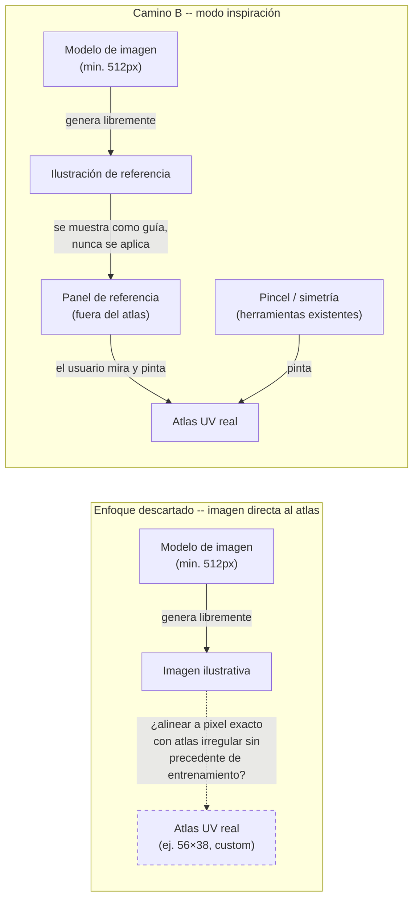
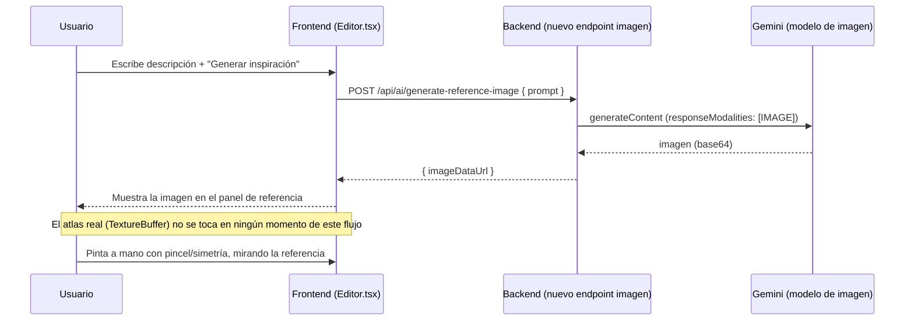

# Definición: Textura con más detalle visual (más allá del color plano)

## Resumen ejecutivo

Marco probó el asistente de color de IA actual y esperaba un resultado con el nivel de detalle de una referencia externa que ya tiene ("CARCOMIDO" -- grietas violetas brillantes, degradados, corrosión pixel a pixel). Lo que la herramienta da hoy es un color plano por cara, por diseño (ticket 089, "primera pasada"). Investigamos la vía obvia -- generación de imagen por IA alineada directamente al atlas UV real -- y la conclusión, con evidencia técnica concreta, es que **hoy no es viable con fidelidad aceptable**: no es un problema de mejor prompting, es una limitación estructural de los modelos de imagen actuales combinada con que nuestro atlas UV (empaquetado dinámico, único por modelo) no tiene ningún precedente de entrenamiento. Este documento presenta dos caminos alternativos, reales y acotados, para que Marco decida cuál (o cuáles, o ninguno) construir.

## Objetivo de negocio

Que Marco (y eventualmente otros usuarios de texture-studio-mc) puedan lograr texturas con detalle visual real -- variación de color, degradados, sensación de corrosión/desgaste -- sin tener que dominar técnicas de pintado pixel a pixel desde cero, dentro del flujo de asistencia de IA que ya existe.

## Alcance

### Incluye

- La investigación de viabilidad ya completada (ver "Diseño técnico") de generar imagen por IA alineada con precisión de pixel al atlas UV real -- **conclusión: no viable hoy**, documentada acá para que la decisión quede trazable y no se vuelva a investigar desde cero.
- Dos caminos alternativos, con sus propias Historias de Usuario, para que el Product Owner elija cuál(es) construir:
  - **Camino A -- Textura procedural mejorada** (sin ningún modelo de imagen): el asistente de color existente pasa de "un color plano por cara" a "un color base + variación" (degradado/ruido), calculado localmente en el navegador -- sin llamada de red adicional, sin costo, sin problema de alineación (porque nunca sale del atlas real).
  - **Camino B -- Modo "inspiración"**: se genera una ilustración libre de referencia (tipo CARCOMIDO) a partir de una descripción, usando un modelo de imagen real -- se muestra dentro del editor como guía visual, el usuario sigue pintando a mano guiándose de ella. **Nunca se aplica automáticamente al atlas.**

### No incluye

- Generación automática de imagen aplicada directo y alineada con precisión de pixel al atlas UV real -- descartado por inviabilidad técnica confirmada, no por decisión de alcance/tiempo.
- Fine-tuning de un modelo propio para este layout UV custom (viable en teoría -- hay proyectos que lo hacen para el layout FIJO de una skin vainilla -- pero es un esfuerzo de meses, claramente fuera de escala acá).
- Reemplazar el asistente de color actual (`Automático`/`Puente manual`, ticket 089) -- ambos caminos son ADITIVOS, conviven con lo que ya existe.
- Elegir el proveedor/modelo definitivo de imagen para el Camino B si se aprueba -- eso se resuelve en el ticket correspondiente, acá solo se deja evaluado con tradeoffs (ver Diseño técnico).

## Historias de Usuario

### HU-1 (Camino A): Propuesta de color con variación, no plana

Como usuario del editor de textura, quiero que la propuesta de color de IA incluya variación (degradado o ruido) en vez de un solo color plano por cara, para que el resultado se sienta con más textura sin tener que pintar todo a mano desde cero.

Criterios de aceptación:
- Dado que pido una propuesta de color (Automático o Puente manual), cuando la IA responde, entonces cada cara pintada tiene un color BASE y una variación calculada localmente (nunca una llamada de red adicional) -- ej. un degradado entre dos tonos, o ruido con una paleta acotada a 2-3 colores relacionados.
- Dado que la propuesta se aplica, cuando reviso el resultado, entonces la variación queda dentro de los límites reales de cada cara (misma garantía de "sin traslape" que ya tiene `validateAndApplyColorProposal`).
- Dado que no quiero variación en una cara puntual, cuando reviso la propuesta antes de aplicarla, entonces puedo ver una vista previa (igual que hoy) antes de confirmar.

### HU-2 (Camino B): Ilustración de referencia para pintar a mano

Como usuario que no tiene una referencia visual clara de qué pintar, quiero pedirle a la IA una ilustración libre de mi personaje a partir de una descripción, para usarla como guía mientras pinto a mano la textura real.

Criterios de aceptación:
- Dado que escribo una descripción y pido "Generar inspiración", cuando la IA responde, entonces veo la ilustración generada en un panel separado del editor (nunca reemplaza ni toca el atlas real).
- Dado que tengo una ilustración de referencia generada, cuando sigo pintando con las herramientas existentes (pincel, simetría, importar imagen), entonces el flujo normal de edición no cambia en nada.
- Dado que genero una nueva ilustración, cuando la pido, entonces se me informa el costo/tiempo esperado antes de confirmar (a diferencia de la asistencia de texto actual, esta llamada no es gratuita).

## Diseño técnico

**Investigación de viabilidad (arquitecto, con fuentes)**:

- **Modelos de imagen disponibles en Gemini hoy** (familia "Nano Banana"): `gemini-3.1-flash-lite-image` (rápido/barato, solo 1K), `gemini-3.1-flash-image` (balanceado, 512px–4K, ~$0.045–$0.151/imagen), `gemini-3-pro-image` (premium, control fino, ~$0.134–$0.24/imagen). Todos soportan texto-a-imagen, imagen-a-imagen, y edición "por máscara" -- pero esa máscara es **descriptiva en lenguaje natural**, no coordenadas de pixel exactas.
- **Dos límites duros para aplicar esto al atlas real**:
  1. **Resolución mínima 512px** -- no existe forma de pedir generación nativa a 64×64 (o menos, o a las dimensiones irregulares que produce `packBoxesUV.ts`). Reducir después de generar es exactamente donde se pierde el borde duro sin antialiasing que exige un Box UV.
  2. **Sin tier gratuito** -- a diferencia del `gemini-3.6-flash` de texto que ya usa `aiAssist.ts` (gratuito, con reintentos), generación de imagen es de pago desde la primera llamada.
- **Evidencia externa de que el problema es más difícil de lo que parece**: el paper "BLOCK: Bi-Stage MLLM Character-to-Skin Pipeline for Minecraft" (2026) confirma que generar el layout **fijo y estándar** de una skin vainilla de Minecraft (64×64, con años de ejemplos en datasets) ya es difícil para modelos generales -- por eso existen proyectos que tuvieron que fine-tunear modelos específicamente para ese layout fijo (Monadical, tombailey). **Nuestro atlas es estrictamente más difícil**: es un layout dinámico y único por modelo custom (`packBoxesUV.ts`, shelf-packing), sin ningún precedente de entrenamiento en ningún dataset existente.
- **Limitación estructural adicional**: los modelos de difusión producen por diseño resultados suaves/antialiased -- pixel art (bordes duros, regiones planas discretas) es, según la literatura, "lo opuesto de lo que la difusión produce nativamente".

**Conclusión**: con el estado del arte actual, ningún proveedor comparable puede alinear con precisión de pixel una imagen generada al atlas UV real de un modelo custom. Es una limitación estructural, no una cuestión de mejor prompting -- confirma y resuelve (en sentido negativo) la decisión que el documento original del epic (`modelado-3d-custom-y-generacion-con-ia.md`, sección "No incluye") había dejado pendiente: *"Integrar una API de IA de pago... queda como decisión técnica documentada y ticket futuro"*.

**Impacto si se construye el Camino B**:
- **Backend**: nuevo endpoint para `generateContent` en modalidad imagen (`responseModalities: ["IMAGE"]`), separado del endpoint de texto actual. Las respuestas base64 de imagen son mucho más pesadas que el JSON de hoy -- el límite `express.json({ limit: '256kb' })` de `app.ts` necesita subir explícitamente.
- **Riesgo de costo real**: hoy `aiAssistRouter` no tiene ningún rate-limiting (ni por IP ni por sesión/proyecto) -- un gap de bajo riesgo mientras todo es gratis, pero se vuelve un riesgo real de abuso de cuota en cuanto se exponga un endpoint de pago. Si se avanza con el Camino B, rate-limiting explícito deja de ser opcional.
- **Cambio de tipo de contrato**: hoy el "resultado de IA" siempre es JSON validado contra un esquema. El Camino B introduce el primer caso donde el resultado es un binario (imagen) -- se trata como un tipo de dato nuevo en el pipeline, no como "un endpoint más" análogo a los tres existentes.
- **Frontend**: estado de carga más largo que el de texto (segundos a decenas de segundos), y un panel de referencia nuevo (nunca se integra al `TextureBuffer`/atlas real).

**Impacto si se construye el Camino A**: acotado -- extiende `colorProposal.ts` (nuevo cálculo de variación local, sin tocar el contrato del prompt de IA de texto existente) y `validateAndApplyColorProposal` (aceptar 2 colores por cara en vez de 1, o un parámetro de variación). Sin cambios de backend.

## Diagramas

*Qué muestra: el enfoque descartado intenta cruzar directo del modelo de imagen al atlas real -- ese cruce (línea punteada) es justo el paso que la investigación confirmó inviable. El Camino B evita ese cruce a propósito: la imagen generada nunca toca el atlas, solo informa al usuario, que sigue pintando con las herramientas que ya existen.*

*Qué muestra: la secuencia completa del Camino B -- la imagen generada llega a un panel de UI separado, nunca se escribe sobre el `TextureBuffer`/atlas real. El pintado real sigue siendo 100% manual, con las herramientas ya existentes.*

## Riesgos y preguntas abiertas

- **¿Cuál camino querés construir -- A, B, ambos, o ninguno por ahora?** Esta es la decisión principal que este documento necesita de vos.
- Si se construye el Camino B: falta decidir el modelo exacto (`gemini-3.1-flash-image` balanceado vs `gemini-3-pro-image` premium/más caro), y si querés un límite de gasto/alerta configurado en la consola de Gemini antes de exponerlo (recomendado por el arquitecto independientemente de qué camino se elija, si se avanza con imagen).
- Si se construye el Camino A: falta decidir el tipo de variación (degradado direccional, ruido tipo Perlin, o ambos) y si el usuario controla la intensidad, o queda fija.
- El rate-limiting ausente en `aiAssistRouter` (`backend/src/routes/aiAssist.ts`) es un gap real hoy, de bajo riesgo mientras todo es gratis -- si se construye el Camino B se vuelve prioritario resolverlo como parte del mismo ticket, no después.

## Impacto estimado

- **Camino A**: 1-2 tickets -- extender `colorProposal.ts`/`validateAndApplyColorProposal` con variación local, ajustar el prompt de texto si hace falta pedir un color de acento además del base, actualizar `test/colorProposal.spec.ts`.
- **Camino B**: 3-4 tickets -- nuevo endpoint de imagen en el backend + rate-limiting, nuevo componente de panel de referencia en el frontend, manejo de estado de carga/costo, tests de integración con el proxy mockeado (mismo patrón que `aiAssist.spec.ts`).
